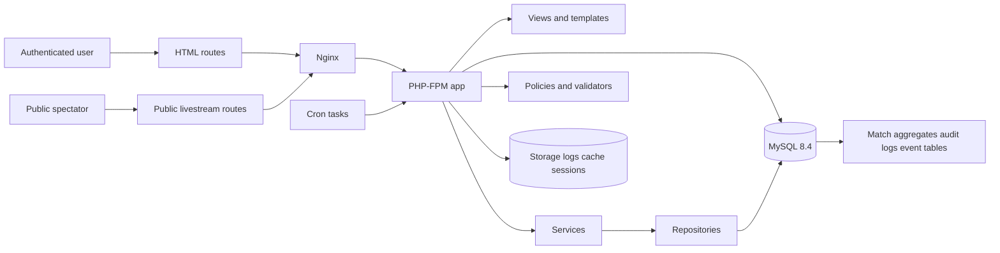
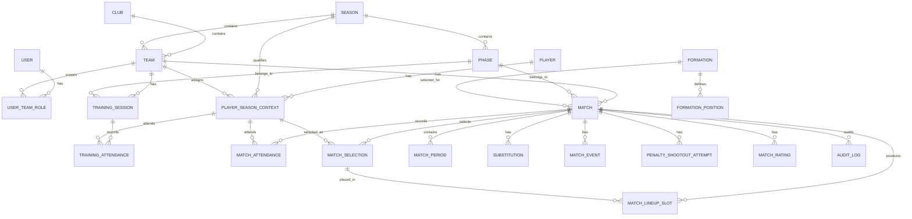

# BarePitch Consolidated Concept Document and Technical Report

## Executive summary

The document set is conceptually strong. It consistently aims for a narrow, disciplined product: a lightweight web application for amateur football team management, optimized for speed, clarity, and low operational complexity. Its strongest through-line is not technical, but product-philosophical: *show only what matters in the current moment*. That principle is clear in the concept document, the design principles, the backend rules, and the server-rendered architecture. The technical architecture also shows unusual maturity for an early corpus: event tables as the source of truth, cached match aggregates for read performance, explicit workflow state, match-level locking, audit-aware corrections, and a strong preference for simple PHP, MySQL, and targeted JavaScript.

The corpus is weaker where it fragments into partially overlapping documents. The biggest issue is not poor quality, but competing “authoritative” sources. The summary database document is materially less complete than the SQL DDL. The architecture document conflicts with the design-principles document on what the public livestream may expose. The lock timeout differs across documents. Several critical operational topics are only lightly covered or absent: accessibility, privacy and GDPR, testing, CI/CD, observability, hosting strategy, cost, migration, and formal API contracts.

This report resolves those conflicts and turns the corpus into a single-source-of-truth design. The final recommendation is to keep the app **shared-hosting-compatible by design**, but to **deploy production on a small VPS by default** because the cost gap is small while the operational control gain is significant. The recommended stack is **PHP 8.4 minimum, 8.5-compatible code**, **MySQL 8.4 LTS with InnoDB**, **server-rendered HTML**, **vanilla JavaScript**, **plain CSS**, **OpenAPI 3.1 plus JSON Schema 2020-12** for machine-readable contracts, and **`application/problem+json`** for JSON error responses. These choices align with current official standards and support horizons. citeturn25search0turn26search0turn2search0turn2search5turn0search1turn8search0

The most important product decision is this: the **public livestream must remain minimal and privacy-safe**. It should show score, match phase, time context, and a minimal timeline of events, but **not full lineup details, player names, ratings, attendance, or analytics by default**. That matches the design-principles document better, reduces cognitive noise, and is more defensible under privacy-by-design and data-minimization principles. Accessibility must also be upgraded beyond the current corpus: WCAG 2.2 requires support for dragging alternatives and minimum target sizes, so any lineup interaction must offer simple tap-based and keyboard-accessible alternatives, even if drag placement exists for convenience. citeturn19search5turn4search5turn3search4turn0search2turn10search0turn15search0

## Deliverable One

**Label:** Deliverable One  
**Type:** Coherent, comprehensive, AI-optimized concept document  
**Status:** Recommended final version

### Product definition

**BarePitch** is a mobile-first web application for managing amateur football teams during the full cycle of a season, with special emphasis on low-friction pre-match preparation, live match control, and limited post-match correction.

The product is not an analytics platform, not a social network, and not a general club ERP. Its core promise is:

> **BarePitch shows only the information needed for the next decision in the current context.**

That makes the primary product values:

- speed of use
- clarity under pressure
- predictable behavior
- minimal cognitive load
- operational simplicity
- privacy by default

### Target users and personas

The source documents identify roles, not personas. The following personas are therefore partly explicit and partly inferred.

| Persona | Primary goal | Frequency | Context | Notes |
|---|---|---:|---|---|
| Coach | Prepare the match, manage lineup, control live match, correct final data | High | On pitch, time pressure, mobile | Primary operational user |
| Trainer | Manage trainings and attendance | Medium | Before and after sessions | Less match-critical |
| Team manager | Administrative support, roster and logistics | Medium | Mixed desktop/mobile | Secondary operational user |
| Administrator | Global configuration, clubs, seasons, users, formations | Low | Desktop preferred | High-privilege user |
| Spectator or parent | Follow public match state | Variable | Public, mobile | Read-only, minimal information exposure |

**Assumption:** the app may be used by youth teams as well as adult amateur teams. Because of that, public exposure must be more conservative than the current architecture document suggests.

### Product scope

**In scope for v1**

- club, season, phase, team, user-role management
- player master records and season context
- training sessions and attendance
- match creation and preparation
- guest player handling
- formation and lineup management
- live match control
- goals, penalties, cards, substitutions, notes
- extra time and penalty shootout handling
- public livestream with minimal payload
- ratings as optional post-match data
- audit logging for post-finish corrections
- localization
- mobile-first interface

**Explicitly out of scope for v1**

- full analytics dashboards
- real-time sockets
- push notifications
- heavy framework or SPA architecture
- photo uploads
- external integrations
- queue-dependent architecture
- advanced search
- general club finance or membership modules

### Core domain rules

The normalized product ontology should be fixed to the following terms.

| Canonical term | Meaning |
|---|---|
| Club | Top-level organization |
| Season | Time-bounded operational container |
| Phase | Subdivision of a season |
| Team | A club team within one season |
| User | Authenticated human account |
| Role | Team-scoped or global permission assignment |
| Player | Persistent player identity across seasons |
| Player season context | The player’s team affiliation for one season, or external status |
| Training session | Scheduled training event |
| Match | Scheduled football match for one team in one phase |
| Match attendance | Status of a player for a specific match |
| Match selection | Players selected for the match squad |
| Match lineup slot | Current or starting on-field placement |
| Match period | One half of regular time or extra time |
| Match event | Goal, penalty, card, note |
| Penalty shootout attempt | Shootout-only attempt, separate from regular score |
| Livestream | Public read-only match projection with token-based access |

**Single-source-of-truth domain decisions**

- `match_event` and `penalty_shootout_attempt` remain the authoritative source of match state.
- Cached score fields on `match` remain performance caches only.
- `match` status remains restricted to `planned`, `prepared`, `active`, `finished`.
- `active_phase` remains restricted to `regular_time`, `extra_time`, `penalty_shootout`.
- Global administrator remains a separate boolean-like capability, not a team role.
- Team roles remain cumulative and team-scoped: `coach`, `trainer`, `team_manager`.

### Product behavior by state

**Planned**

The goal is preparation. The UI may show availability, guest players, formation, lineup, and bench composition. It must not show live controls or post-match analysis.

**Prepared**

The goal is confirmation and final adjustment. The UI may show final lineup, bench, and start controls. It must not mix in analytics or dense historical context.

**Active**

The goal is live decision support. The UI may show score, phase, lineup state, bench, quick event controls, substitutions, and period controls. It must not surface non-actionable analytics that compete with the live task.

**Finished**

The goal is review and correction. The UI may show final result, events, playing time, ratings, and audit-aware correction tools. Heavy dashboards remain out of scope by default.

### Public livestream definition

The corpus contains a conflict here. The final decision is:

**Public livestream shows:**

- team display names
- current score
- match phase
- elapsed context
- event timeline at a minimal level
- livestream expiry state

**Public livestream does not show by default:**

- full lineup
- player names
- attendance
- ratings
- historical statistics
- tactical context

Where player attribution is operationally useful, the safer v1 default is **shirt number only** or **no player attribution at all**, unless a club explicitly enables a more permissive mode and has a clear lawful basis and consent model. This follows the product philosophy and better reflects privacy-by-design and data-minimization obligations. citeturn19search5turn4search5turn3search4

### Information architecture

The app should be structured around operational tasks, not around deep navigation trees.

**Primary navigation**

- Dashboard
- Team
- Players
- Trainings
- Matches
- Settings

**Team area**

- Overview
- Players
- Trainings
- Matches

**Match area**

- Overview
- Preparation
- Live control
- Review

**Settings**

- Clubs
- Seasons
- Formations
- Users
- Roles
- Localization

### AI optimization rules

This concept document should become the **main human-readable source of truth** for product behavior. To make the project easy for AI systems to read, reason over, and extend, the following conventions should be adopted:

- Use one canonical term for each concept and never switch between synonyms in schema, API, and UI copy.
- Use lower_snake_case for enums, route resource names, database fields, and JSON keys.
- Use ISO 8601 for timestamps and dates in APIs.
- Use BCP 47 locale tags such as `en`, `en-GB`, `nl-NL`. citeturn12search1
- Define all JSON contracts in OpenAPI 3.1 with JSON Schema 2020-12 references so both humans and machines can consume the same contract. citeturn2search5turn0search1
- Keep enumerations closed and explicit.
- Keep all state-transition preconditions explicit and machine-testable.
- Store promptable metadata close to the domain model: role matrix, state machine, event taxonomy, validation rules, and field descriptions.
- Archive older design documents after this consolidation so downstream AI processes do not treat outdated summaries as equal authorities.

### Final concept statement

BarePitch is a low-complexity, server-rendered match operations tool for amateur football teams. It is optimized for fast, predictable mobile use, gives coaches and staff exactly the information needed for the current task, keeps public output deliberately minimal, and favors explicit domain rules over technical abstraction.

## Deliverable Two

**Label:** Deliverable Two  
**Type:** Detailed technical report covering all technical aspects  
**Status:** Recommended final version

### Recommended architecture

**Application architecture**

- server-rendered PHP application
- small vanilla JavaScript modules for interaction only
- plain CSS with tokenized variables
- MySQL as primary relational store
- polling instead of WebSockets
- cron instead of queue workers for v1
- OpenAPI-defined JSON endpoints alongside HTML routes
- application-level match locking with atomic acquisition
- no heavy ORM
- no Node.js requirement on the server

**Final stack choice**

| Layer | Recommended choice | Why |
|---|---|---|
| Runtime | PHP 8.4 minimum, 8.5-compatible code | Best balance between support runway and hosting compatibility |
| Web | Nginx + PHP-FPM | Low overhead, stable |
| Database | MySQL 8.4 LTS, InnoDB | Fits corpus, stable LTS, ACID, CHECK support |
| Rendering | Native PHP templates | Matches product and hosting constraints |
| JavaScript | Vanilla ES modules | Enough for lineup, polling, lock refresh |
| CSS | Plain CSS with variables | Matches corpus and long-term maintainability |
| API contract | OpenAPI 3.1 + JSON Schema 2020-12 | Machine-readable, future-proof |
| Error format | `application/problem+json` | Standardized for AI and client interoperability |
| Auth | Email magic link | Lowest friction for v1 |
| Sessions | Secure server-side session cookies | Simpler and safer than custom token storage in browser |
| Jobs | Cron only | Adequate for cleanup, expiry, backups |
| Cache | None required in v1, optional file cache only | Avoid premature infrastructure |

OpenAPI 3.1 exists specifically to give both humans and computers a standard way to discover and understand an HTTP API, and OpenAPI 3.1 aligns with JSON Schema 2020-12. RFC 9457 defines `application/problem+json` specifically to standardize machine-readable HTTP API errors. MySQL 8.4 is an LTS release, and InnoDB is explicitly ACID-compliant. PHP 8.4 remains within mainstream support windows while staying more realistic for conservative hosting than bleeding-edge adoption. citeturn2search5turn0search1turn8search0turn26search0turn2search0turn25search0

### Architecture diagram

### Comparison tables

**Application stack options**

| Option | Fit with corpus | Operational complexity | Speed to build | Long-term fit | Recommendation |
|---|---:|---:|---:|---:|---|
| Plain PHP SSR + thin JS | Very high | Low | High | High | **Choose** |
| Full PHP framework | Medium | Medium | Medium | Medium | Not needed for v1 |
| SPA + API backend | Low | High | Low | Medium | Reject for v1 |

**Database options**

| Option | Strength | Weakness | Final judgment |
|---|---|---|---|
| MySQL 8.4 LTS | Best alignment with documents, easy hosting, ACID, CHECK constraints, predictable ops | Less flexible than PostgreSQL for future advanced querying | **Choose** |
| PostgreSQL | Excellent concurrency model and strong data features | Breaks with corpus assumptions, raises hosting and ops complexity | Valid future branch, not v1 |
| SQLite | Tiny operational footprint | Single-writer limitations make live multi-user editing a poor fit | Reject |

MySQL 8.4 is the best fit because the corpus is already deeply shaped around MySQL and its hosting profile, while still benefiting from LTS support and InnoDB ACID behavior. PostgreSQL remains technically attractive because of strong MVCC semantics, but SQLite’s “at most one writer” model makes it materially weaker for concurrent live-edit scenarios. citeturn26search0turn2search0turn2search2turn14search7turn14search6

**Hosting options**

| Option | Monthly infra baseline | Strength | Weakness | Final judgment |
|---|---:|---|---|---|
| Shared hosting | Low | Cheapest, simple | Weak control over cron, logging, deploys, backups, security tuning | Keep compatibility, do not make it default production target |
| Small VPS | Low to moderate | Full control, good value, cron, backups, firewall, CI/CD target | Requires basic sysadmin competence | **Choose** |
| Managed PaaS | Moderate | Very easy deploys and scaling | Cost grows quickly, PHP support may require Docker path | Good future option, not default |

Current official price references show that the cost gap between entry shared hosting and small VPS hosting is often only a few euros or dollars per month, while a PaaS workspace plus compute can be substantially higher. Namecheap shared renewal starts around $48.88 per year for its basic plan, Hetzner’s CX22 shared-vCPU cloud starts at €3.79 per month, DigitalOcean basic droplets start at $4 per month, and Render Pro starts at $25 per month *before* compute and data costs. That makes a small VPS the best production default for BarePitch. citeturn24view0turn21search1turn20search0turn23view0

**Authentication options**

| Option | Strength | Weakness | Final judgment |
|---|---|---|---|
| Magic link | Lowest friction, no password storage burden | Email account security becomes critical | **Choose for v1** |
| Password + reset | Familiar | More UX friction, password storage and recovery burden | Not preferred |
| OIDC / SSO | Strong for larger organizations | Overkill for v1 and amateur-team context | Future option only |

For v1, magic links are the right trade-off. They must be single-use, short-lived, hashed at rest, generated with cryptographically secure randomness, and accompanied by neutral responses, session hardening, logging, and optional step-up authentication for administrator-sensitive actions. OWASP also recommends server-side authorization and careful session management, while PHP provides `random_bytes()` for secure token generation and secure session-cookie controls. citeturn17search3turn16search1turn5search0turn6search0turn1search0turn17search5

### Data model and schema

The SQL DDL is more complete than the database summary document and should therefore become the schema baseline. However, the final recommended schema makes four important corrections.

**Schema decisions**

- Keep the existing major tables and relations from the SQL DDL.
- Replace the polymorphic `attendance` table with two explicit tables:
  - `training_attendance`
  - `match_attendance`
- Remove `injury_note` from v1 unless and until legal basis, access scope, retention, and security treatment are explicitly defined.
- Store **hashed** livestream tokens, not plaintext livestream tokens.
- Make `season_context_id` authoritative in `match_selection`; either remove redundant `player_id` or enforce pair consistency structurally.
- Keep `match_event` and `penalty_shootout_attempt` as the only score authorities.
- Keep cached match scores and shootout scores on `match` for fast reads.

**Why the attendance split matters**

The polymorphic `attendance(context_type, context_id)` design is the weakest data-model choice in the corpus because it undermines referential integrity while the wider corpus repeatedly argues for explicit relations and strong structural guarantees. Splitting match and training attendance restores database-level clarity and makes future auditing, deletion policies, and reports easier.

**Why injury notes should not enter v1**

An injury free-text field creates legal and governance risk that is disproportionate to the operational need. The product logic only requires an availability signal such as `injured`. Under privacy-by-design, data minimization, storage limitation, and security-of-processing principles, the application should collect the least personal data necessary for the operational purpose. BarePitch does not need medical detail to decide whether a player is available. citeturn19search5turn4search5turn3search4turn3search2

### ER diagram

### API design

The corpus documents readable HTML routes well, but the JSON contract is under-specified. The final recommendation is to keep both layers:

- **HTML routes** for the user-facing server-rendered application
- **`/api/v1` JSON routes** for polling, dynamic interactions, and AI-readable contracts

**API rules**

- Use OpenAPI 3.1 as contract source.
- Use JSON Schema 2020-12 for request and response schemas.
- Use `application/problem+json` for errors.
- Use `POST`, `PUT`, `PATCH`, `DELETE` only for state changes.
- Do not use `GET` for mutating actions. citeturn2search5turn0search1turn8search0turn0search0

**Recommended canonical API**

| Method | Endpoint | Auth | Role | Rate limit | Notes |
|---|---|---|---|---|---|
| POST | `/api/v1/auth/magic-links` | Public | None | 5 per hour per email, 20 per hour per IP | Neutral response always |
| GET | `/api/v1/auth/magic-links/consume` | Public | None | Low | Single-use token |
| POST | `/api/v1/auth/logout` | Session | Any | Normal | Ends session |
| GET | `/api/v1/teams/{teamId}` | Session | Team member | 120/min/session | Team overview |
| GET | `/api/v1/teams/{teamId}/players` | Session | Team member | 120/min/session | Paginated |
| POST | `/api/v1/teams/{teamId}/players` | Session | Team manager or admin | 30/min/session | Create player |
| PATCH | `/api/v1/players/{playerId}` | Session | Team manager or admin | 30/min/session | Update player |
| GET | `/api/v1/teams/{teamId}/trainings` | Session | Team member | 120/min/session | Paginated |
| POST | `/api/v1/teams/{teamId}/trainings` | Session | Trainer or admin | 30/min/session | Create training |
| PUT | `/api/v1/trainings/{trainingId}/attendance` | Session | Trainer or admin | 30/min/session | Bulk attendance write |
| POST | `/api/v1/teams/{teamId}/matches` | Session | Coach or admin | 30/min/session | Create match |
| PATCH | `/api/v1/matches/{matchId}` | Session | Coach or admin | 30/min/session | Update metadata |
| POST | `/api/v1/matches/{matchId}/lock/acquire` | Session | Coach or admin | 20/min/session | Atomic acquire |
| POST | `/api/v1/matches/{matchId}/lock/refresh` | Session | Lock owner | 60/min/session | Heartbeat every 30s |
| POST | `/api/v1/matches/{matchId}/lock/release` | Session | Lock owner | 20/min/session | Explicit release |
| PUT | `/api/v1/matches/{matchId}/attendance` | Session | Coach or team manager or admin | 30/min/session | Bulk attendance write |
| PUT | `/api/v1/matches/{matchId}/lineup` | Session | Coach or admin | 30/min/session | Save formation and lineup |
| POST | `/api/v1/matches/{matchId}/prepare` | Session | Coach or admin | 10/min/session | Transition to prepared |
| POST | `/api/v1/matches/{matchId}/start` | Session | Coach or admin | 10/min/session | Start live match |
| POST | `/api/v1/matches/{matchId}/events` | Session | Coach or admin | 60/min/session | Goal, card, note |
| POST | `/api/v1/matches/{matchId}/substitutions` | Session | Coach or admin | 30/min/session | Substitution |
| POST | `/api/v1/matches/{matchId}/periods/end` | Session | Coach or admin | 10/min/session | Manual end |
| POST | `/api/v1/matches/{matchId}/phases/next` | Session | Coach or admin | 10/min/session | Next half or phase |
| POST | `/api/v1/matches/{matchId}/shootout-attempts` | Session | Coach or admin | 30/min/session | Shootout entry |
| POST | `/api/v1/matches/{matchId}/finish` | Session | Coach or admin | 10/min/session | Finish match |
| PUT | `/api/v1/matches/{matchId}/ratings` | Session | Coach or admin | 30/min/session | Optional |
| GET | `/api/v1/live/{token}` | Public | None | 60/min/IP | Public state |
| GET | `/api/v1/live/{token}/poll` | Public | None | 60/min/IP | Polling only |

When throttling is required, HTTP 429 is the correct response, and `Retry-After` may be used to communicate backoff. citeturn13search0

### Frontend architecture

**Final frontend design**

- SSR first
- thin enhancement layer
- no client-side store as the source of truth
- page-scoped state only
- accessible alternatives for all drag interactions
- minimal JavaScript bundle boundaries:
  - `app.js`
  - `match-editor.js`
  - `livestream.js`
  - `lineup-grid.js`

**Accessibility**

The corpus is mobile-first, but not yet accessibility-complete. The final standard should be:

- keyboard operable by default
- visible focus states
- internal touch-target standard of **44×44 px**
- WCAG-compliant minimum of **24×24 CSS px** guaranteed at worst
- drag-and-drop never required as the only way to place or move players
- all live-updating regions announced appropriately
- form errors clearly identified and programmatically associated

WCAG 2.2 explicitly adds target-size guidance and requires alternatives for dragging interactions. That matters directly for the lineup grid and swipe/drag interactions described in the corpus. citeturn0search2turn10search0turn10search1turn15search0

**State management**

- server is authoritative
- forms and JSON writes return canonical updated state
- client stores only ephemeral UI state:
  - open drawer
  - selected player chip
  - pending drag candidate
  - last poll timestamp

**Internationalization**

- locale keys use BCP 47
- translations remain in JSON files
- user locale stored on user profile
- fallback locale required
- no localized data in relational tables unless it is actual user content

### Backend architecture

**Application layers**

- Controller
- Service
- Repository
- Validator
- Policy

This separation is already strong in the corpus and should remain intact.

**Locking**

Keep application-level locking, but change acquisition to an **atomic database update** instead of read-then-write. Final lock policy:

- TTL: **120 seconds**
- refresh every **30 seconds**
- read-only fallback allowed when locked by another user
- explicit release on save, cancel, or close
- lock only editor routes, never read-only routes

The 2-minute timeout is better than the competing 5-minute suggestion because BarePitch includes live match control, and stale locks during a live match are more harmful than relatively quick reacquisition. The heartbeat reduces accidental expiry during active use.

**Transactions**

A mutation transaction should wrap:

- source write
- score or aggregate recalculation if relevant
- match aggregate update
- audit write if relevant
- commit or rollback

This aligns with InnoDB ACID semantics and the current event-sourced read/write split. citeturn2search0turn2search4

**Caching**

- no Redis in v1
- optional file cache for static lists such as formations and language bundles
- no cache that bypasses database truth for live match state

**Search**

Search is not substantively defined in the corpus. Final v1 decision:

- **no full-text search**
- indexed SQL filters only:
  - players by name
  - matches by team/date/status
  - trainings by team/date

**Background jobs**

Use cron, not queue workers:

- expire old locks
- prune used and expired magic links
- stop expired livestreams defensively
- rotate logs
- run backups
- run integrity checks and slow housekeeping

### Security, privacy, and compliance

**Security baseline**

- HTTPS only
- secure, HttpOnly, SameSite session cookies
- session regeneration on login and privilege changes
- no state-changing GET routes
- CSRF protection on all state-changing form and JSON actions
- server-side policy checks on every write
- strict default-deny authorization posture
- structured logging without secrets
- hashed magic-link tokens
- hashed livestream tokens
- CSP, HSTS, `X-Content-Type-Options`, `Referrer-Policy`, `frame-ancestors`

OWASP recommends CSRF defenses for state-changing requests, secure session handling, server-side authorization enforcement, and careful logging hygiene. PHP supports secure cookie parameters and warns that session regeneration must be handled carefully on unstable networks. OWASP also recommends excluding session identifiers, tokens, and unnecessary personal data from logs. citeturn0search0turn16search1turn6search0turn1search0turn17search5turn11search3turn18search0turn18search2

**Threat model**

| Threat | Primary risk | Control |
|---|---|---|
| Account takeover via emailed magic link | Unauthorized team access | Short TTL, single use, token hash, email rate limits, admin step-up |
| CSRF | Unauthorized write actions | CSRF tokens, SameSite cookies, no mutating GETs |
| XSS | Session theft, unauthorized actions | Output escaping, CSP, no untrusted HTML rendering |
| Broken authorization | Cross-team access or illicit corrections | Policy layer on every write, test coverage per role |
| Lock race | Simultaneous conflicting edits | Atomic lock acquisition, TTL, refresh, read-only fallback |
| Stale public token leakage | Public data disclosure | Token hash, short expiry, manual stop, no player-identifying data |
| Over-collection of personal data | GDPR and trust risk | Data minimization, remove injury notes, retention controls |
| Silent data drift after corrections | Incorrect stats and audit gaps | Recalculate from events, audit every finished-match correction |

**GDPR posture**

BarePitch processes names, email addresses, attendance, user roles, and potentially player availability information. The final design should therefore implement:

- privacy by design
- privacy by default
- data minimization
- retention control
- access logging for privileged changes
- explicit not-to-log secret handling
- documented lawful basis per data class

Under GDPR principles, personal data must be limited to specified purposes, minimized, kept accurate, not stored longer than necessary, and processed securely. The European Commission’s privacy-by-design guidance also stresses that by default only necessary data should be processed and exposed. citeturn4search5turn3search4turn19search5turn3search2

**Retention recommendations**

| Data | Recommended retention |
|---|---|
| Magic-link records | 30 days for fraud diagnostics, then purge |
| Session records | Session lifetime plus short forensic window |
| Livestream access tokens | Until expiry plus 7 days, hashed only |
| Audit logs | Minimum 2 seasons or 24 months |
| Error logs | 30 to 90 days |
| Match and season records | Operational archive, club policy-driven |
| Backup snapshots | 14 to 35 days rolling |

### Deployment, CI/CD, observability, and SRE

**Recommended production topology**

- 1 small VPS in EU region
- Nginx
- PHP-FPM
- MySQL 8.4 LTS
- daily database backups
- object or remote backup target
- uptime probe
- centralized deploy via GitHub Actions
- infrastructure manifests in IaC form if moving beyond a single VPS

**CI/CD**

Use entity["company","GitHub","developer platform"] Actions for:

- linting
- unit and integration tests
- OpenAPI validation
- migration smoke tests
- deployment over SSH or rsync
- post-deploy health check

GitHub Actions is an official CI/CD platform that supports automated build, test, and deployment pipelines via YAML-defined workflows stored in the repository. citeturn11search1turn11search8

**Monitoring and logging**

- health endpoint for app and poll routes
- Nginx access logs
- application logs in structured JSON
- MySQL slow query log
- alert on:
  - repeated auth failures
  - lock acquisition anomalies
  - high 5xx rate
  - poll endpoint degradation
  - backup failure

**SRE posture**

Full formal SRE practice is not necessary for v1, but the following are.

- health checks
- error budgets at a simple level
- documented rollback
- backup restoration drill
- deploy checklist
- least-privilege runtime credentials

### Performance budgets and testing strategy

**Budgets**

| Budget item | Target |
|---|---:|
| HTML TTFB p95 | under 500 ms |
| Match mutation round-trip p95 | under 700 ms |
| Public poll response payload | under 25 KB gzip |
| CSS total | under 80 KB uncompressed |
| JS total | under 120 KB uncompressed |
| Mobile LCP on primary pages | under 2.5 s |

**Testing strategy**

- **Unit tests:** validators, state transitions, statistic rules, role checks
- **Integration tests:** event writes, recalculation, correction flow, lock flow
- **Contract tests:** OpenAPI schema conformance
- **End-to-end tests:** login, lineup, match flow, livestream, corrections
- **Accessibility tests:** keyboard path, visible focus, screen-reader labels, non-drag alternatives
- **Load tests:** livestream poll endpoint and live event write contention
- **Security tests:** CSRF, authorization matrix, reflected and stored XSS, token replay

## Decision log

| Area | Conflict or gap | Final decision | Rationale | Document evidence |
|---|---|---|---|---|
| Lock timeout | 5 minutes in one doc, 2 minutes in another | **2-minute TTL + 30-second heartbeat** | Better for live match handover and stale-lock recovery | Architecture/API v1.0 §10.3 vs Backend Rules v1.0 §3.3–3.4 |
| Public livestream payload | Architecture includes current lineup; design principles exclude lineup details | **No lineup details or player names by default** | Stronger product fit and privacy-by-default | Architecture/API v1.0 §15.2 vs Design Principles v1.0 §5.1 |
| Database authority | Summary DB doc omits many DDL tables and columns | **SQL DDL is schema source of truth** | Most complete source | Database Structure v2.2 vs Schema v1.0 SQL |
| Attendance model | Current schema uses polymorphic `attendance` | **Split into `training_attendance` and `match_attendance`** | Restores referential integrity | SQL DDL `attendance` vs corpus-wide integrity goals |
| Injury data | Schema stores `injury_note` | **Remove free-text injury note from v1** | Minimization and privacy-risk reduction | SQL DDL `attendance.injury_note`; concept only needs `injured` status |
| Livestream token storage | Raw token currently stored | **Store hash only** | Reduces impact of DB compromise | SQL DDL `match.livestream_token`; security pattern already used for magic links |
| JSON error format | Ad hoc success/error object | **RFC 9457 problem details** | Standardized, AI-friendly | Architecture/API v1.0 §9 |
| HTML vs API routes | JSON layer only partially specified | **Keep SSR routes, add versioned `/api/v1` contracts** | Prevents route ambiguity and enables machine-readability | Architecture/API v1.0 §§6, 8, 9 |
| Deployment target | Corpus optimizes for shared hosting | **Deploy on small VPS, keep shared-hosting-compatible code** | Better ops control for nearly the same cost | Architecture/API, PHP Architecture, Bootstrap, cost comparison |
| PHP version | “PHP 8.x” only | **PHP 8.4 minimum, 8.5-compatible** | Better hosting realism than forcing latest minor while staying supported | Multiple docs say PHP 8.x |
| DB version | “MySQL 8.x or compatible” | **MySQL 8.4 LTS** | Stability, support, alignment | Architecture/API v1.0 §3 |
| Match selection redundancy | `match_selection` stores both `player_id` and `season_context_id` | **Make season context authoritative and enforce consistency** | Avoid silent inconsistency | SQL DDL `match_selection` |

## Roadmap and costs

### Implementation roadmap

| Phase | Weeks | Output | Main risks |
|---|---:|---|---|
| Foundation | 1–2 | Final concept, ADRs, OpenAPI skeleton, SQL migration baseline, auth bootstrap | Scope drift |
| Core admin | 3–4 | Clubs, seasons, teams, users, roles, players, season context | Permission drift |
| Training flow | 5 | Training CRUD and explicit attendance tables | Attendance model changes |
| Match preparation | 6–7 | Match CRUD, attendance, guest players, formation, lineup, lock flow | UI complexity |
| Live match engine | 8–9 | Events, substitutions, periods, extra time, shootout, recalculation | Concurrency and correction logic |
| Public livestream | 10 | Public token flow, minimal poll endpoint, expiry controls | Privacy leakage |
| Hardening | 11 | Accessibility pass, observability, tests, backup drills, security headers | Late-stage bugs |
| Release | 12 | Production deploy, rollback plan, training, documentation | Missing operational playbooks |

### Migration and integration plan

The corpus assumes no external integrations in v1. The safest migration path is therefore not from another system in code, but from *documents to implementation*.

**Recommended plan**

- archive old documents after approval
- keep this concept document as product SSoT
- generate OpenAPI spec from this technical report
- derive SQL migrations from final schema decisions
- track all later changes as ADRs
- postpone external integrations until the core event engine is stable

### Cost estimate

**Recommended baseline production setup**

| Item | Lean option | Safer option |
|---|---:|---:|
| Hosting | small VPS | small VPS with managed backup |
| Email delivery | low-volume transactional provider | same, with domain setup and monitoring |
| Domain and TLS | standard domain + Let’s Encrypt | same |
| Monitoring | uptime probe + logs | uptime probe + external log shipping |
| Backups | daily dump + remote copy | dumps + snapshots + restore drills |

Using currently advertised official pricing as directional input, a lean BarePitch v1 can operate on very low monthly infrastructure cost. Entry shared hosting renews around the low single-digit dollars per month, Hetzner’s small cloud starts at €3.79 per month, DigitalOcean basic droplets start at $4 per month, and Postmark’s basic transactional email plan starts at $15 per month. Render’s Pro workspace starts at $25 per month before compute and bandwidth, which is why it is not the cost-optimal default for this project. citeturn24view0turn21search1turn20search0turn21search8turn23view0

**Practical budget guidance**

- **Lean self-managed v1:** low tens per month
- **Safer self-managed v1 with backups and monitoring:** low to mid tens per month
- **Managed PaaS variant:** noticeably higher baseline, often unnecessary for this scope

The real cost center is not infrastructure but disciplined implementation, testing, and hardening.

## Open questions and limitations

Several points remain unspecified in the source corpus and should be explicitly decided before coding begins.

- **Player age profile:** if youth teams are included, privacy defaults become materially stricter.
- **Legal basis and consent:** especially for public livestream and any player-identifying public data.
- **Small-sided football variants:** the corpus assumes at least 11 present players before preparation, which may not fit all amateur contexts.
- **Ratings scope:** ratings are present in schema and backend rules but sit uneasily with the “nothing extra” philosophy. They should remain optional and hidden by default.
- **Guest-player policy boundaries:** it is still unclear whether guest borrowing may cross clubs or only teams within one club.
- **Health data handling:** this report recommends excluding injury notes from v1; if that is rejected, a dedicated privacy and retention decision is required.

The final recommendation is to approve this consolidated design, retire the conflicting summaries, and treat the next artifacts as the formal implementation trilogy:

- **this concept document** for product truth
- **OpenAPI 3.1 specification** for contract truth
- **SQL migrations** for relational truth