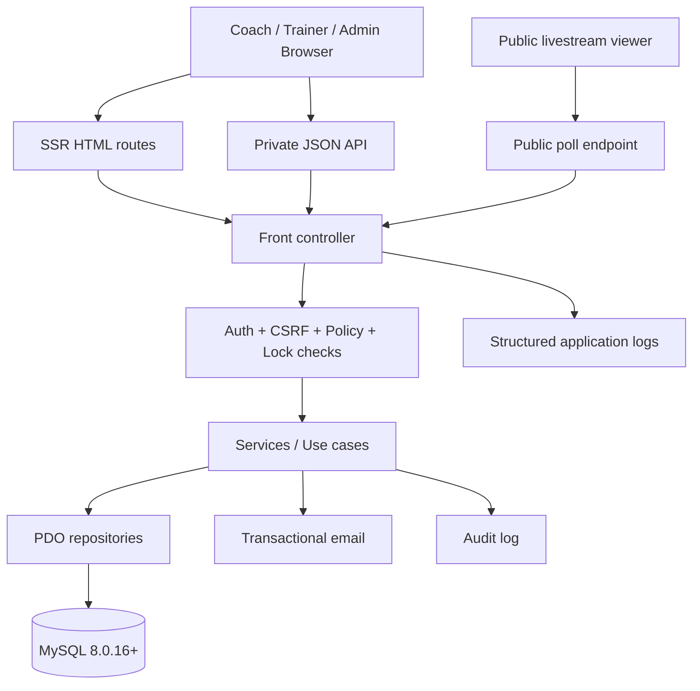
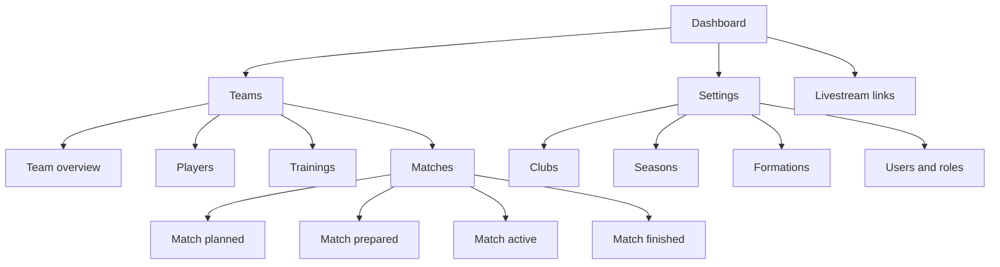
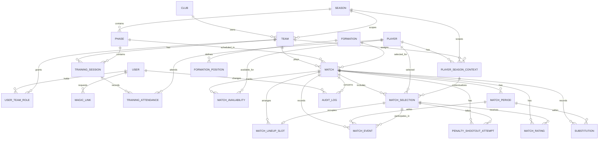
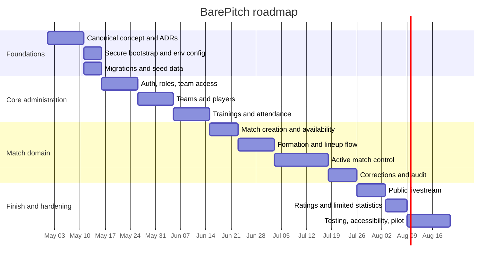

# BarePitch Web App Deep Analysis and AI-Optimized Concept

## Executive summary

The document set already contains a strong product thesis. BarePitch is consistently framed as a lightweight, mobile-first, low-cognitive-load web app for amateur football team operations, with the match workflow as its core value center. Across the concept, design, architecture, database, styling, and backend-rule documents, the dominant idea is stable: server-rendered pages, very limited JavaScript, explicit rules, shared-hosting compatibility, and a strict “show only what matters now” philosophy. That coherence is a real strength, because it narrows the product and prevents accidental drift toward a bloated team-management suite. [Docs: C 9-25, C 29-35, D 24-31, D 153-199, A 13-25, P 22-33, ST 11-20]

The strongest part of the current material is the match domain. Match states, period transitions, locking, score recalculation, correction handling, auditability, red-card rules, lineup preparation, and the distinction between event tables and cached aggregates are all thought through at a level that is unusually concrete for an early product package. The SQL schema is materially more mature than the higher-level “database structure” document and covers operational concerns such as match periods, substitutions, ratings, magic links, and audit logs. [Docs: C 132-148, C 171-203, B 124-213, B 321-479, A 339-423, SQL 144-159, SQL 299-557, S 31-61]

The weakest part is not the core idea but the layer around it. The current set under-specifies personas, information architecture, MVP boundaries, API contracts, deployment, monitoring, migrations, backup/restore, privacy handling, and long-term maintenance. It also contains several real discrepancies: the lock timeout is 5 minutes in one document and 2 minutes in another, the public livestream is minimal in the design guide but includes current lineup in the architecture guide, the architecture documents disagree on whether Policy is an explicit layer, and the “full database schema” document is no longer actually the full schema. [Docs: A 359-364, B 72-88, D 70-84, A 571-585, A 63-142, P 55-158, DB 7-18, SQL 1-557]

My recommendation is to preserve the existing philosophy, not replace it. The best direction is a web-only, server-rendered PHP application with a lightweight internal JSON API for live interactions, backed by MySQL 8.0.16+ as the explicit target engine, with event-driven score truth, cached aggregates for speed, strong policy enforcement, conservative public livestream scope, and a stricter operational baseline than the current bootstrap suggests. That keeps the product true to its concept while removing the most likely sources of failure in production. [Docs: A 171-192, A 307-335, A 621-653, P 448-500, B 240-268, S 31-61] citeturn0search0turn11search0turn11search1turn19search2

The single most important strategic decision is this: BarePitch should remain an operational decision tool, not become an analytics platform. When the documents are strongest, they are strongest because they honor that boundary. The optimized concept below therefore keeps reporting and statistics subordinate to the before-match, during-match, and immediate after-match workflows. [Docs: D 65-146, D 252-275, A 488-557]

## Source base and assessment frame

This report is based on the uploaded BarePitch documents and uses the following shorthand for file references: **C** = concept document, **D** = design principles, **A** = architecture and API, **B** = backend rules and validation, **DB** = database structure, **SQL** = SQL DDL, **S** = SQL notes, **P** = PHP structure guide, **Boot** = bootstrap guide, **ST** = styling guide. Line ranges cited in this report refer to those uploaded files. External guidance is prioritized from official product documentation, standards, and the original REST dissertation, especially from entity["organization","OWASP","security nonprofit"], entity["organization","NIST","standards institute"], entity["organization","W3C","web standards consortium"], the entity["organization","European Commission","eu executive body"], and entity["organization","OpenTelemetry","observability project"]. citeturn12search3turn0search0turn2search0turn2search2turn2search1turn10view0turn14search0turn3search2turn15search7

The target platform is specified as web only by your instruction. The broader target audience beyond the role model already present in the documents is unspecified. Budget is unspecified. Timeline is unspecified. In the roadmap below, estimates are therefore given as planning ranges under a clear implementation assumption rather than as commitments.

### Working assumptions and boundaries

The current documents implicitly define five user domains: administrator, coach, trainer, team manager, and public livestream audience. They do **not** define player self-service, parent accounts, federation-level administration, native mobile apps, or external sports-data integrations as v1 scope. The optimized concept retains that boundary because it is aligned with the strongest design rule in the package: one clear purpose per screen and no “nice to have” features without immediate operational value. [Docs: C 73-99, D 153-199, A 196-216, A 656-665]

### Maturity by domain

| Domain | Current maturity | Assessment |
|---|---:|---|
| Product thesis | High | Clear and surprisingly disciplined |
| Match workflows | High | The most mature and internally detailed area |
| Training workflows | Medium | Present, but less behaviorally specified |
| Data model | Medium | Strong schema depth, uneven conceptual documentation |
| UI/design system | Medium | Coherent principles, limited accessibility specification |
| API contracts | Medium-Low | Good route inventory, weak formal contract design |
| Security model | Medium | Sound intent, incomplete hardening details |
| Deployment/monitoring | Low | The largest gap in the package |
| Testing/maintenance | Low | Barely specified today |

This maturity pattern matters. It means the project is not under-conceived overall. It is overdeveloped in one domain and underdeveloped in the operational envelope around that domain. That is fixable without changing the product’s identity. [Docs: A 219-303, B 321-479, DB 7-18, SQL 1-557, P 664-723, Boot 7-16]

## Cross-document analysis

The documents overlap heavily on architectural philosophy, domain boundaries, and match logic. They diverge mainly when moving from principle to implementation detail. In other words, the “why” is mostly aligned, while the “how exactly” is where the inconsistencies appear. [Docs: C 29-35, D 24-31, A 29-42, P 24-33, ST 11-20]

### Where the overlap is strongest

Almost every document reinforces the same technical posture: PHP, MySQL, server-side rendering, minimal runtime overhead, no heavy framework, no Node.js requirement on the server, no SPA, no websockets, and progressive enhancement with small vanilla JavaScript modules only where operationally necessary. The styling guide, structure guide, and architecture guide all point in the same direction. That reduces architectural ambiguity and is a major strength for maintainability. [Docs: A 13-25, A 46-60, P 11-19, P 36-52, P 528-567, ST 11-20, ST 349-392] citeturn13search3turn13search7

The second strong overlap is the data integrity philosophy. The concept, backend rules, structure guide, SQL notes, and schema all converge on the same principle: domain truth lives in source tables, while cached values exist for operational read performance. In practice, this means goals and shootout goals are derived from `match_event` and `penalty_shootout_attempt`, then cached on `match` for fast UI reads. That is a sound and scalable choice for this kind of product. [Docs: C 243-248, B 31-37, B 158-198, S 31-61, SQL 444-505] citeturn11search0turn11search1

The third strong overlap is BarePitch’s conceptual discipline. The design guide repeatedly rejects parallel information streams, analytics clutter, and historical noise on primary screens. The architecture guide’s state-specific screen flows broadly follow that principle, especially for planned, prepared, active, and finished match screens. [Docs: D 51-57, D 65-146, D 162-199, A 488-557]

### Major discrepancies and recommended resolution

| Topic | Evidence of conflict | Why it matters | Recommended resolution |
|---|---|---|---|
| Lock timeout | A says **5 minutes** of inactivity; B says **2 minutes** with **30-second refresh** | Too short risks accidental edit loss in poor mobile conditions; too long risks blocking collaborators | Choose **3 minutes** with **30-second heartbeat**, visible countdown, explicit “take over expired lock” flow |
| Public livestream content | D says public livestream must **not** show lineup details; A polling payload includes **current lineup** | This violates the core product philosophy and leaks unnecessary tactical detail | Public livestream should show **score, phase, time, goals, cards, substitutions, status** only. No lineups by default |
| Policy layer | A’s structure lacks a dedicated `/Policy` layer; P and B explicitly include one | Authorization is central and tactical vs administrative actions are distinct | Keep an explicit **Policy/Authorization layer** |
| Database completeness | DB calls itself the “full schema,” but SQL includes many more tables and fields | Misleads future development and creates documentation drift | Treat **SQL DDL as closer to implementation truth**, then rewrite DB doc to match |
| Bootstrap security | Boot uses hardcoded DB credentials and plain `session_start()`; P and A assume secure sessions, env config, CSRF, auth, logging | Prototype bootstrap is not production-safe | Replace bootstrap with **env-driven config, secure session options, error handling, logger, mailer abstraction** |
| External integrations | C says v1 excludes external integrations, but auth requires email delivery | Hidden operational dependency | Reframe as: **no business-domain integrations in v1, but transactional email is mandatory** |
| Full-stack scope discipline | D rejects “nice to have”; SQL introduces optional-looking profile and tagging entities | Risk of schema-led scope creep | Mark **player_profile** and some advanced metadata as **P1/P2**, not core v1 |

[Docs: A 359-364, B 72-88, D 70-84, A 571-585, A 63-142, P 55-158, B 528-560, DB 7-18, SQL 144-557, Boot 51-72, C 350-357, A 223-230]

### Core strengths

The concept is unusually good at choosing what **not** to build. That matters more than it sounds. Many sports-management tools die under their own ambition. BarePitch’s explicit non-goals, mobile-first thinking, and emphasis on predictable behavior give it a fighting chance of becoming genuinely usable under pressure. [Docs: C 19-25, C 350-357, D 192-199, ST 337-359]

The SQL schema is more than a passive storage design. It already encodes operational realities: season-scoped teams, match locks, event ordering, match periods, substitutions, ratings, audit trails, and public livestream lifecycle fields. That is a sign that the backend thinking is grounded in real workflow, not generic CRUD. [Docs: SQL 77-108, SQL 144-159, SQL 299-348, SQL 350-557]

The architectural separation between controllers, services, repositories, validators, and policies is conceptually strong, even where the documents are inconsistent about folder naming. It gives the project a maintainable spine without forcing a heavyweight framework. [Docs: A 367-423, B 528-560, P 223-255, P 271-334, P 681-703]

### Core weaknesses

The product is role-aware but not persona-explicit. The documents define permissions well enough, but they do not yet state distinct user goals, pains, and success criteria. That makes scope decisions harder later, because features can start being justified “for someone” without a clear primary user. [Docs: C 73-99, A 196-216]

The training domain is materially under-specified compared with the match domain. The schema includes `training_session` and `training_focus`, and the route map includes training flows, but there is little comparable behavioral detail for sequencing, editing rules, attendance correction, or what should be visible to which role at which moment. [Docs: A 258-266, A 388-393, SQL 215-245]

The operational model is thin. There is little about environment management, migrations, seeded data, backup and restore, structured logging, alerting, deploy strategy, or recovery. The project therefore risks becoming conceptually elegant but operationally brittle. [Docs: P 628-650, P 642-662, Boot 42-55]

## Technical assessment

### Target architecture

The current documents imply a front-controller PHP application with SSR as the default, plus a small set of JSON endpoints for interactions such as live polling, lock refresh, lineup interactions, and quick event registration. That basic direction is sound. It fits the stated hosting constraints, aligns with the product’s action-oriented screens, and keeps the system simple enough to reason about. [Docs: A 146-192, P 371-409, Boot 19-36]



This architecture becomes much safer if the app adopts a firm distinction between **page routes** and **API routes**. Right now, the route inventory mixes human-facing pages and machine-facing interaction endpoints. For maintainability, BarePitch should keep SSR pages for navigation and forms, and place all JavaScript interaction endpoints under a versioned `/api/v1` namespace. That gives the web app a stable contract without creating an unnecessary public platform API. [Docs: A 219-335] citeturn0search0turn12search3

### Data model and persistence

The strongest data-model choice is the separation between persistent event truth and cached operational aggregates. That should remain untouched. It is exactly the right tradeoff for a match-centric app on modest infrastructure: source tables preserve correctness, while cached score columns preserve speed for match lists, dashboards, and livestream views. [Docs: B 158-198, S 31-61, SQL 299-348, SQL 444-505] citeturn11search0turn11search1

There are, however, three important modeling weaknesses.

First, the “database structure” document is behind the SQL DDL by a meaningful margin. It omits `magic_link`, `player_profile`, `training_session`, `training_focus`, `attendance`, `formation`, `formation_position`, `match_lineup_slot`, `match_period`, `substitution`, and `match_rating`, even though these are already present in the actual DDL. That makes DB too abstract to act as the canonical reference. [Docs: DB 31-208, SQL 144-557]

Second, the current `attendance` table is polymorphic through `context_type` and `context_id`. That is flexible, but it weakens referential integrity because the database cannot enforce a proper foreign key from one column pair to two different parent tables. For a product with only two attendance contexts, the better design is to split this into `training_attendance` and `match_availability`. That improves integrity, query clarity, and future reasoning. [Docs: SQL 247-267]

Third, the documents are precise about the source of truth for **scores**, but not equally precise about the source of truth for **playing time** and **current on-field state**. Since `playing_time_seconds` lives on `match_selection`, and current placement lives on `match_lineup_slot`, corrections can become unreliable unless those values are explicitly defined as recalculable aggregates derived from lineup baseline, periods, substitutions, and sent-off events. The optimized concept below makes that rule explicit. [Docs: C 271-289, SQL 350-400, SQL 402-442]

### API, interactions, and workflow design

The route set is good as a workflow inventory. It covers authentication, teams, players, trainings, match preparation, state transitions, event registration, shootout handling, ratings, and public livestream access. That inventory is broad enough for a v1 and demonstrates that major use cases have already been spotted. [Docs: A 223-303]

The main weakness is contract granularity. The documents tell us **which** endpoints exist far more clearly than they tell us **what** each request and response must contain. For an AI-assisted build and long-term maintainability, BarePitch should formalize payload contracts, status codes, error codes, idempotency assumptions, and permission rules per endpoint. The current generic success/error envelope is a start, but it needs to become a proper API specification. [Docs: A 307-335] citeturn0search0turn12search3

The use of command-like POST endpoints such as `/matches/{id}/prepare` and `/matches/{id}/start` is acceptable because these are application commands rather than simple field replacements. HTTP does not require every mutation to be modeled as PUT or PATCH, and POST is explicitly intended for resource-specific processing. What matters is consistency, clarity, and correct status-code behavior. citeturn0search0

### Security, privacy, and reliability

The internal security posture is directionally good. The documents already mandate prepared statements, CSRF protection for state-changing requests, server-side authorization, team-scoped access control, secure session cookies, and hashed magic links. Those are the right instincts. [Docs: A 646-653, B 272-315, P 489-520] citeturn0search1turn1search1turn2search0turn2search2

Two areas need immediate strengthening.

The first is authentication hardening. Email magic links are operationally simple and fit the project’s low-friction design, but they should not be treated as high-assurance authentication. Current NIST guidance does not allow email as an out-of-band authenticator because of interception and account-takeover risks. For BarePitch, that does not rule out email magic links in v1, but it does mean the implementation needs compensating controls: short expiry, one-time use, hashed storage, neutral responses, throttling, suspicious-activity logging, and optional MFA for privileged roles such as administrators and coaches. [Docs: A 56-57, A 651-652, P 504-520] citeturn2search1turn18view1turn18view2

The second is privacy-by-design. This app will process personal data, and depending on the teams involved, it may also process minors’ data and subjective ratings. European data-protection principles require purpose limitation, data minimization, and careful retention. BarePitch’s anti-bloat philosophy is a good product principle and also a good privacy principle, but it needs to be implemented explicitly through retention rules, role-based visibility, and a documented legal basis for player ratings and attendance. [Docs: D 24-31, D 192-199, C 324-347] citeturn15search0turn15search7turn15search9turn15search10

Reliability under concurrent interaction is another subtle point. The documents are right to avoid long-running database transactions for editing locks. However, standard PHP sessions can serialize concurrent requests from the same user if the session remains open through polling or multiple AJAX calls. On match screens, BarePitch should close sessions as early as possible after reading what it needs, then reopen only when a write is required. That matters especially for lock refresh and live interaction. [Docs: B 44-68, P 491-500, Boot 51-55] citeturn5search0turn17search1

### Scalability, deployment, monitoring, and maintenance

The size of the product is small enough that shared-hosting compatibility is realistic at launch, but “shared-hosting-compatible” and “best production choice” are not the same thing. The codebase should remain deployable on shared hosting, because that enforces healthy simplicity. But the recommended production baseline for a pilot beyond a single small team is a managed VPS or managed PHP host that gives you stronger control over logs, cron, backups, and release handling. [Docs: A 13-18, P 11-19, P 642-662] citeturn13search3turn13search7

The project also needs a firmer engine target. The DDL depends heavily on foreign keys and check constraints. MySQL only added core `CHECK` support in 8.0.16, while MariaDB compatibility depends on version-specific behavior. The phrase “MySQL 8.x or compatible” is therefore too loose for a core schema like this. The app should standardize on **MySQL 8.0.16+** or on one explicitly tested MariaDB version and treat that as part of the product contract. [Docs: A 50-52, S 11-15, SQL 3-3, SQL 55-56, SQL 104-107, SQL 141-142, SQL 344-347, SQL 474-477] citeturn19search2turn19search1turn11search1

Monitoring is currently the thinnest domain in the package. The docs mention file logs and audit logs, but not structured event shape, correlation IDs, review process, alerting, failure budgets, or observability conventions. A lightweight application can still benefit from structured logs and correlated request context, and over time those logs can be exported into a vendor-neutral observability model if needed. [Docs: B 513-524, P 628-650] citeturn14search0turn3search1turn3search2

## Decision log and recommended target architecture

### Recommended choices

| Decision area | Options considered | Chosen option | Reason |
|---|---|---|---|
| Runtime architecture | Custom lightweight PHP kernel, Slim 4, Laravel 12 | **Custom lightweight PHP kernel with selected battle-tested libraries** | Best fit with existing docs, lowest conceptual drift, lowest runtime overhead |
| Routing/API surface | Unversioned mixed routes, full public API, internal versioned API | **SSR pages + internal `/api/v1` JSON API** | Preserves simplicity while formalizing live interactions |
| Auth | Passwords, email magic links, full MFA | **Email magic links in v1 + optional MFA for privileged roles** | Lowest friction, acceptable if hardened |
| Public livestream | Match-centered rich audience page, minimal “what matters now” page | **Minimal page without lineup details** | Matches the strongest design principle |
| Database engine | “MySQL-compatible”, MySQL 8 strict target, MariaDB strict target | **MySQL 8.0.16+ strict target** | DDL depends on modern constraint support |
| Attendance model | One polymorphic table, two explicit tables | **Two explicit tables** | Better integrity and clearer queries |
| Token storage | Plaintext URL tokens, hashed tokens | **Hashed tokens for magic links and livestream links** | Capability URLs should be treated as secrets |
| Locking | 2 minutes, 5 minutes, middle-ground | **3-minute timeout + 30-second refresh** | Better balance between collaboration and field reliability |

### Tech stack options

| Option | Fit to BarePitch | Pros | Cons | Recommendation |
|---|---|---|---|---|
| **Custom lightweight PHP kernel + PDO + native templates** | Excellent | Closest to existing documents, minimal runtime, full control, no framework drag | You must own more infrastructure code quality | **Choose this** |
| **Slim 4 + PDO + SSR templates** | Good | Good routing and middleware support with low overhead | More dependencies, weaker alignment with the current “own the spine” approach | Viable fallback if custom kernel grows too much |
| **Laravel 12** | Moderate | Strong ecosystem, batteries included, polished DX | Larger lifecycle, more conventions, more features than v1 needs, often pushes toward workers/queues and broader framework assumptions | Not recommended for v1 |

Slim 4 is a respectable option because it gives routing and middleware without forcing a heavy runtime, but it still adds PSR-7 dependencies and framework structure. Laravel is technically capable, but its request lifecycle, service-provider model, and queue-oriented ecosystem are broader than this product currently needs. For BarePitch’s current scope, a custom lightweight kernel is the better fit if it is paired with disciplined boundaries and not used as an excuse to reinvent everything. citeturn13search0turn3search3turn4search0turn4search1

## AI-optimized concept document

### Product definition

**Product name:** BarePitch

**Product type:** Web-only operational app for amateur football team staff

**Core promise:** Show what matters, when it matters, and remove everything else.

**Primary problem:** Coaches and team staff need one fast, reliable, low-noise tool for preparing squads, running matches, recording events, and correcting match data afterward without losing integrity.

**Primary users inferred from the current documents:** coach, trainer, team manager, administrator, public livestream viewer. Broader market segmentation is unspecified. [Docs: C 73-99, A 196-216]

**Explicit non-goals for v1:** native apps, websocket infrastructure, push notifications, player photos, external sports-data integrations, public analytics dashboards, player self-service, parent portals, and algorithmic “smart coaching” features. [Docs: C 350-357, A 656-665, D 252-275]

**Operational dependencies in v1:** transactional email for magic-link authentication, HTTPS, MySQL 8.0.16+, and a deploy target that supports a front-controller PHP application. [Docs: A 223-230, A 646-653, Boot 19-36] citeturn13search3turn19search2

### Product principles and scope rules

The following principles are normative for the build:

1. **Action first.** Primary screens must support an immediate task, not general browsing. [Docs: D 184-199]
2. **Context governs visibility.** Planned, prepared, active, and finished match states must each have different screen priorities. [Docs: C 142-148, D 47-58]
3. **Server-rendered by default.** JavaScript enhances interaction; it does not own the product logic. [Docs: A 169-192, P 528-549]
4. **One truth, many projections.** Source tables hold domain truth; cached aggregates exist only for read speed. [Docs: B 158-198, S 31-61]
5. **Tactical and administrative actions are distinct.** Coach powers must not bleed carelessly into trainer/team-manager powers. [Docs: B 301-315]
6. **Public livestream is informational, not tactical.** It is intentionally limited. [Docs: D 65-84]
7. **No feature by default if its removal changes nothing operationally.** [Docs: D 237-246]

### User personas

| Persona | Goal | Pressure point | Primary surfaces |
|---|---|---|---|
| Coach | Prepare squad, control match, correct final record | Time pressure and one-handed mobile use during match | Match preparation, active match, finished match |
| Trainer | Manage trainings and attendance | Repetitive admin work | Team, training session, attendance |
| Team manager | Support roster and admin data | Accuracy and consistency | Players, team settings, match availability |
| Administrator | Maintain cross-team structure and user assignments | Governance and permissions | Settings, clubs, seasons, users |
| Public viewer | Follow match outcome and key moments | Needs clarity, not tactical detail | Livestream only |

### User journeys

#### Match preparation

1. Coach opens upcoming match.
2. Match availability is filled for the roster.
3. Guest players may be added as internal or external guests.
4. Formation is selected.
5. Starting eleven and bench are assigned.
6. Validation checks run.
7. Match transitions from `planned` to `prepared`.

#### Live match control

1. Coach acquires edit lock.
2. Match starts and enters `active`.
3. Quick actions record goals, cards, penalties, substitutions, and notes.
4. Period transitions are manually confirmed.
5. If needed, extra time or shootout begins.
6. Match finishes.
7. Public livestream remains available until expiry unless manually stopped.

#### Post-match correction

1. Coach or admin reopens finished match.
2. Corrections are applied to source records.
3. Aggregates are recalculated deterministically.
4. Audit entries are written.
5. Ratings may be saved, but only complete ratings affect averages.

#### Training administration

1. Trainer creates training session.
2. Attendance is recorded.
3. Optional focus tags are saved.
4. Attendance summaries update for team context.

### Prioritized feature list

| Priority | Feature | Included in v1 | Reason |
|---|---|---:|---|
| P0 | Authentication via email magic link | Yes | Required entry path |
| P0 | Clubs, seasons, phases, teams | Yes | Foundational structure |
| P0 | Team-scoped roles and permissions | Yes | Fundamental access model |
| P0 | Players and season context | Yes | Core roster model |
| P0 | Match availability and guest players | Yes | Necessary for preparation flow |
| P0 | Formation library and lineup grid | Yes | Central coach workflow |
| P0 | Match lifecycle and period transitions | Yes | Core domain |
| P0 | Event registration and substitutions | Yes | Core domain |
| P0 | Finished-match corrections with audit log | Yes | Data integrity requirement |
| P0 | Minimal public livestream | Yes | Already core to concept |
| P0 | i18n for UI strings | Yes | Present in concept and architecture |
| P0 | Logging, backups, migrations, deploy hygiene | Yes | Missing today but required for real launch |
| P1 | Ratings | Yes, but secondary | Allowed, but must stay subordinate |
| P1 | Training focus tags | Optional | Useful, but not essential |
| P1 | Player profile metadata | Optional | Keep if it supports real decisions |
| P1 | Statistics summary screens | Limited | Operational summaries only |
| P2 | CSV export | Optional | Useful later |
| P2 | Notifications | No | Not aligned with v1 boundary |
| P2 | External integrations | No | Explicitly out of scope |
| P2 | Player self-service | No | Not defined anywhere in current set |
| P3 | Advanced analytics | No | Violates product thesis |

### Information architecture



This structure should remain shallow. The primary navigation should be few items, and match screens should adapt by state rather than forcing the user to navigate separate sections during urgent work. [Docs: D 47-58, D 153-199, A 488-557]

### Data model

#### Recommended data rules

The optimized concept keeps the general domain model but introduces four clearer rules:

- `match_event` and `penalty_shootout_attempt` remain the source of truth for scores.
- `playing_time_seconds` on `match_selection` is a cached aggregate and must be recalculated after corrections.
- Public livestream tokens are stored as hashes, not plaintext.
- The current polymorphic `attendance` design is replaced by two explicit tables: `training_attendance` and `match_availability`.

#### ER diagram



#### Key entity decisions

| Entity | Chosen design | Reason |
|---|---|---|
| Player season context | Keep one record per player per season | Strong existing model; prevents hidden duplication |
| Guest players | Keep match-based guest status | Correctly models occasional borrowing |
| Opponent | Keep as text in v1 | Right tradeoff for amateur context |
| Ratings | Keep optional, complete-only in averages | Matches design discipline |
| Training focus | Keep optional tags | Useful but not central |
| Player profile | Keep optional or defer if unused | Prevent schema-led scope creep |
| Availability | Split from training attendance | Better integrity than polymorphism |

### API design

#### API strategy

BarePitch should have **two surfaces**:

- **SSR web routes** for page navigation, forms, and redirects
- **Versioned internal JSON API** for live interactions and progressive enhancement

This is the preferred compromise between product simplicity and contract clarity. It stays close to the current documents while giving the codebase a stable machine-facing layer. [Docs: A 171-192, A 307-335] citeturn0search0turn12search3

#### Auth model

| Surface | Auth model | Notes |
|---|---|---|
| Staff app | Secure session cookie | `HttpOnly`, `Secure`, `SameSite=Lax or Strict`, regenerated on login |
| State-changing requests | Session + CSRF token | Required on all mutating routes |
| Public livestream | Opaque public token in URL | Store hash in DB; keep page free of third-party scripts |

Session configuration should be set before `session_start()`, and session IDs should be regenerated on login. Because PHP warns that regeneration can be tricky on unstable networks, the implementation should preserve the old session briefly with a destroy timestamp instead of hard-deleting it immediately. citeturn1search1turn1search0

#### Response conventions

For the JSON API, use HTTP status codes as the primary signal.

**Success**
```json
{
  "data": {},
  "meta": {}
}
```

**Error**
```json
{
  "error": {
    "code": "forbidden",
    "message": "You do not have permission to perform this action.",
    "details": {}
  }
}
```

This is cleaner than carrying a `success` boolean on every response and remains easy for browser-side JavaScript and AI tooling to interpret. citeturn0search0

#### Core endpoints

| Method | Path | Auth | Purpose |
|---|---|---|---|
| POST | `/api/v1/auth/magic-links/request` | Public | Request sign-in link |
| GET | `/login/consume?t=...` | Public | Browser login redirect flow |
| POST | `/api/v1/auth/logout` | Session | End session |
| GET | `/api/v1/me` | Session | Current user context |
| GET | `/api/v1/teams/{teamId}` | Session | Team overview |
| GET | `/api/v1/teams/{teamId}/players` | Session | Team player list |
| POST | `/api/v1/teams/{teamId}/players` | Session | Create player |
| PATCH | `/api/v1/players/{playerId}` | Session | Update player |
| GET | `/api/v1/teams/{teamId}/trainings` | Session | Training list |
| POST | `/api/v1/teams/{teamId}/trainings` | Session | Create training |
| PUT | `/api/v1/trainings/{trainingId}/attendance` | Session | Save training attendance |
| GET | `/api/v1/teams/{teamId}/matches/{matchId}` | Session | Match detail for current state |
| POST | `/api/v1/teams/{teamId}/matches` | Session | Create match |
| PATCH | `/api/v1/matches/{matchId}` | Session | Update match metadata |
| PUT | `/api/v1/matches/{matchId}/availability` | Session | Save match availability |
| PUT | `/api/v1/matches/{matchId}/lineup` | Session | Save lineup |
| POST | `/api/v1/matches/{matchId}/prepare` | Session | Planned → prepared |
| POST | `/api/v1/matches/{matchId}/lock/acquire` | Session | Acquire edit lock |
| POST | `/api/v1/matches/{matchId}/lock/refresh` | Session | Refresh edit lock |
| POST | `/api/v1/matches/{matchId}/lock/release` | Session | Release edit lock |
| POST | `/api/v1/matches/{matchId}/start` | Session | Prepared → active |
| POST | `/api/v1/matches/{matchId}/periods/end` | Session | End current period |
| POST | `/api/v1/matches/{matchId}/phases/next` | Session | Start next phase |
| POST | `/api/v1/matches/{matchId}/events` | Session | Register event |
| PATCH | `/api/v1/match-events/{eventId}` | Session | Correct event |
| DELETE | `/api/v1/match-events/{eventId}` | Session | Delete event |
| POST | `/api/v1/matches/{matchId}/substitutions` | Session | Register substitution |
| POST | `/api/v1/matches/{matchId}/shootout-attempts` | Session | Register shootout attempt |
| POST | `/api/v1/matches/{matchId}/finish` | Session | Finish match |
| PUT | `/api/v1/matches/{matchId}/ratings` | Session | Save ratings |
| GET | `/live/{token}` | Public | Livestream page |
| GET | `/api/v1/live/{token}` | Public | Polling payload |

#### Example payloads

**Create match**
```json
{
  "phase_id": 12,
  "date": "2026-09-19",
  "kick_off_time": "14:30:00",
  "opponent": "SV Example 2",
  "home_away": "home",
  "match_type": "league",
  "regular_half_duration_minutes": 45,
  "extra_time_half_duration_minutes": 15
}
```

**Save match availability**
```json
{
  "players": [
    { "player_id": 101, "status": "present" },
    { "player_id": 102, "status": "injured" },
    { "player_id": 103, "status": "absent" }
  ]
}
```

**Save lineup**
```json
{
  "formation_id": 3,
  "starting": [
    { "match_selection_id": 1001, "grid_row": 1, "grid_col": 6 },
    { "match_selection_id": 1002, "grid_row": 3, "grid_col": 3 }
  ],
  "bench": [1009, 1010, 1011]
}
```

**Register event**
```json
{
  "match_second": 1825,
  "period_id": 501,
  "team_side": "own",
  "event_type": "goal",
  "player_selection_id": 1002,
  "assist_selection_id": 1004,
  "penalty_outcome": null,
  "zone_code": "mr",
  "note_text": null
}
```

**Register substitution**
```json
{
  "period_id": 501,
  "match_second": 3120,
  "player_off_selection_id": 1005,
  "player_on_selection_id": 1010
}
```

**Livestream payload**
```json
{
  "data": {
    "match_id": 9001,
    "team_name": "BarePitch U19",
    "opponent": "SV Example 2",
    "status": "active",
    "phase": "regular_time",
    "score": { "own": 2, "opponent": 1 },
    "events": [
      { "match_second": 1825, "type": "goal", "team_side": "own", "label": "Goal 1-0" },
      { "match_second": 3120, "type": "substitution", "team_side": "own", "label": "Substitution" }
    ],
    "expires_at": "2026-09-20T14:30:00Z"
  }
}
```

### Proposed tech stack

#### Chosen stack

| Layer | Choice | Why |
|---|---|---|
| Runtime | PHP 8.x on Apache or Nginx/PHP-FPM | Matches existing philosophy and hosting constraints |
| App architecture | Custom lightweight kernel | Best balance of control and simplicity |
| Routing | Central route table | Clear and explicit |
| Views | Native PHP templates with strict escaping helpers | Low overhead, easy hosting |
| Data access | PDO + explicit SQL repositories | Strong fit to current docs |
| Database | MySQL 8.0.16+ | Needed for constraint support and predictable behavior |
| CSS | Plain CSS with variables and modular files | Already defined well |
| JS | Small vanilla ES modules | Enough for live interactions |
| Mail | SMTP / transactional email provider | Required for magic links |
| Logs | Structured application logs + audit logs | Operational minimum |
| Testing | PHPUnit + browser E2E in CI | Strong coverage with modest complexity |

#### Pros and cons of the chosen stack

**Pros**

- Extremely strong alignment with current BarePitch materials
- Low runtime complexity
- Cheap to host
- Easy to reason about
- Stable under slow-change product development

**Cons**

- More responsibility for internal architecture quality
- Easier to underbuild infra concerns such as error handling and DI
- Requires discipline to avoid custom-framework sprawl

For that reason, the chosen stack should still use narrow, proven libraries where they clearly reduce risk. The keyword is not “from scratch.” The keyword is “minimal.” [Docs: A 46-60, P 36-52, P 448-475, ST 349-392]

### Deployment and scaling plan

#### Deployment recommendation

Use a codebase that remains shared-hosting-compatible, but if budget allows, deploy the pilot to a **small managed VPS or managed PHP environment** rather than the weakest possible shared host. The reason is not performance first. It is operations first: logs, cron, backups, SSL, environment secrets, and release management. [Docs: A 13-18, P 354-367, P 628-650, Boot 59-72] citeturn13search3turn13search7

#### Release topology

- **Local**: Docker or local PHP/MySQL dev setup
- **Staging**: production-like environment with seeded test data
- **Production**: managed VPS or managed PHP host
- **Deploy method**: build artifact or release folder deployment, never hand-edited prod code
- **Database**: versioned SQL migrations, reversible where practical
- **Backups**: nightly full database backup + point-in-time capability if host permits
- **Restore tests**: scheduled and documented

#### Scaling stages

| Stage | Expected load | Architecture |
|---|---|---|
| Stage 1 | Single club / few teams | Single PHP app + single MySQL DB |
| Stage 2 | Multiple clubs, more public livestream traffic | Move from weak shared hosting to managed VPS, optimize polling, add CDN for static assets |
| Stage 3 | Heavy concurrent live usage | Add read-side optimization, optional cache, optional separated DB host |
| Stage 4 | Much larger product | Re-evaluate whether queues, cache, or deeper framework support are justified |

The point is to **earn** infrastructure complexity. The current concept is strongest when complexity is added only after real evidence, not in anticipation. [Docs: D 192-199, A 656-665]

### Security and privacy considerations

#### Security baseline

- Prepared statements only
- CSRF protection on all mutating requests
- Role and team policy check on every write
- Secure session cookies with `HttpOnly`, `Secure`, and `SameSite`
- Session regeneration on login
- Hashed one-time magic links
- Hashed public livestream tokens
- Login throttling and suspicious-activity logging
- Optional MFA for privileged roles
- Neutral auth responses to avoid account discovery
- No raw tokens, stack traces, or DB details in user-facing errors or logs

These controls align with the current documents and with mainstream web application guidance. [Docs: A 646-653, B 482-524, P 591-639] citeturn0search1turn1search1turn2search0turn2search2turn18view1turn14search0

#### Privacy baseline

- Collect only data needed for roster, availability, match operations, and limited performance review
- Define retention periods separately for logs, audit records, availability data, ratings, and dormant users
- Treat player ratings as potentially sensitive operational data
- If youth teams are included, apply extra caution to visibility, retention, and legal basis
- Do not reuse player data for analytics or marketing without a separate legal basis
- Make privacy notices explicit by role and purpose

This is both a legal and product-quality issue. BarePitch is strongest when it resists collecting data simply because it can. citeturn15search0turn15search7turn15search9turn15search10

#### Accessibility baseline

The existing documents already make a good start with mobile-first design and 44×44 touch targets. To reach a stronger accessibility baseline, the UI should also explicitly define focus-visible states, contrast requirements, reflow behavior, and non-text contrast. [Docs: ST 315-359] citeturn10view0turn9view1turn8view2

### Testing strategy

Testing is currently under-specified, so the strategy below is part of the optimized concept, not a reading of the current docs.

| Test level | Scope | Tools |
|---|---|---|
| Unit | Validators, policies, helpers, calculations | PHPUnit |
| Service | Match transitions, lock rules, correction logic, aggregate recalculation | PHPUnit |
| Integration | PDO repositories against a real test DB | PHPUnit + test MySQL |
| Contract | JSON error shapes, status codes, auth boundaries | HTTP/integration tests |
| End-to-end | Mobile and desktop flows through real browser | Playwright in CI |
| Accessibility | Keyboard flow, focus, contrast, mobile layout | Automated + manual checks |
| Load | Public livestream polling and active-match mutation hotspots | Lightweight load scripts |

PHPUnit is the right foundation for backend testing, and Playwright is a good fit for cross-browser and mobile-viewport flows even though BarePitch does not require Node.js on the server. Node in CI is not the same as Node in production. citeturn6view0turn3search0

#### Highest-value test scenarios

1. Planned → prepared validation fails when fewer than 11 present players exist
2. Prepared → active only allowed for coach
3. Goal correction recalculates cached score correctly
4. Shootout does not change regular match score
5. Red-carded player cannot re-enter
6. Lock expires, refreshes, and blocks conflicting edits correctly
7. Finished-match correction writes audit records
8. Public livestream never leaks lineup details
9. Session-based concurrent requests do not deadlock match editing
10. Ratings marked incomplete never affect averages

### Monitoring, logging, and maintenance

#### Monitoring baseline

At minimum, BarePitch should record:

- request ID
- user ID if authenticated
- team ID and match ID when relevant
- route/action
- outcome status
- exception class if failed
- lock conflicts
- auth request patterns
- score recalculation failures
- correction events
- livestream poll latency

Application and audit logs should be separate. Security-relevant events should be reviewable without exposing raw tokens or excessive PII. citeturn14search0turn3search1turn3search2

#### Maintenance baseline

- One canonical concept document
- One canonical schema document generated from or synchronized with migrations
- Architecture decision records for major changes
- Quarterly doc/schema drift review
- Regular restore drills
- Performance review on match and livestream endpoints after each major milestone

The current package already shows signs of documentation drift. That will accelerate once coding starts unless ownership is explicit.

### Roadmap with milestones and estimates

**Assumption for estimates:** one experienced full-stack developer, part-time design and QA support, no native app, web only, no business-domain integrations.



#### Milestone summary

| Milestone | Outcome | Estimate |
|---|---|---:|
| Foundation | Canonicalized docs, secure bootstrap, migrations, environments | 2–3 weeks |
| Core admin | Auth, roles, teams, players | 2 weeks |
| Training | Trainings and attendance | 2 weeks |
| Match preparation | Matches, availability, formation, lineup | 2–3 weeks |
| Live match domain | Events, substitutions, periods, corrections | 3–4 weeks |
| Livestream and finish | Public live, ratings, stats, polish | 2 weeks |
| Hardening and pilot | QA, accessibility, performance, deploy, restore tests | 2 weeks |

**Total planning range:** roughly **12–16 weeks** for a strong v1, depending on implementation depth and design/QA availability.

### Risks and mitigations

| Risk | Severity | Why it matters | Mitigation |
|---|---:|---|---|
| Scope drift toward analytics | High | Directly undermines product clarity | Keep strict P0/P1/P2 rule set |
| Documentation drift | High | Already visible between DB doc and SQL | Make migrations and schema docs a single source regime |
| Session locking stalls live UX | High | Can serialise requests for same user | Close session early on read paths |
| Weak email auth hardening | High | Account takeover risk | Short TTL, one-time links, rate limiting, optional MFA |
| Public livestream over-exposes tactical data | Medium | Violates concept and privacy expectations | Keep livestream minimal |
| Shared-hosting unpredictability | Medium | Operational fragility under match load | Prototype on shared-compatible code, pilot on managed host |
| Correction logic corrupts aggregates | Medium | Trust in app collapses | Recalculate from source on every relevant correction |
| Privacy issues with youth teams and ratings | Medium | Legal and trust risk | Purpose limitation, retention rules, visibility controls |
| Over-custom framework code | Medium | Maintenance burden later | Use narrow libraries where risk is real |
| Ambiguous DB engine compatibility | Medium | Schema may behave differently | Standardize engine target |

### Open questions and limitations

The uploaded documents do not answer several decisions that should be settled before implementation begins:

- Whether BarePitch is only for one club, a multi-club SaaS, or a bespoke internal tool
- Whether youth teams and minors are definitely in scope
- Whether ratings are truly wanted in v1 or are already a scope leak
- Whether player self-service is intentionally absent long-term or only absent for v1
- Which hosting constraints are real budget constraints versus provisional assumptions
- Which email delivery path will be used for magic links

These are not blockers for building the v1 architecture above, but they materially affect privacy configuration, tenant design, and rollout planning.