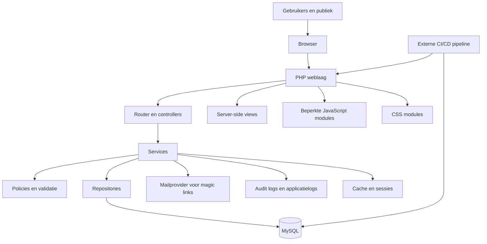
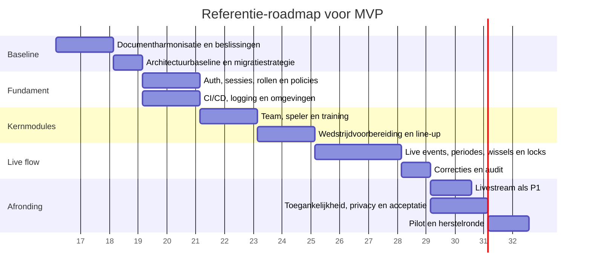

# Analyse van de bijlagen voor de nieuwe webapp

## Executive summary

De documentenset vormt een stevige inhoudelijke basis voor een eerste versie van de app. De kern is opvallend consistent: een lichte webapp voor amateurvoetbal, gericht op snelle invoer rond trainingen en wedstrijden, mobiele bruikbaarheid, voorspelbaar gedrag, server-side rendering, weinig afhankelijkheden en lage operationele complexiteit. In vrijwel alle uitwerkingsdocumenten komt dezelfde technische richting terug: PHP 8, MySQL 8, native templates, directe SQL via PDO, beperkte JavaScript en bewust géén SPA, websockets of zware frameworks. Conceptueel is de productfilosofie ook sterk: toon alleen wat in het moment relevant is. fileciteturn2file1 fileciteturn2file0 fileciteturn3file1 fileciteturn5file0 fileciteturn3file2

Tegelijk is de set nog geen stabiele realisatiebaseline. De belangrijkste problemen zijn synchronisatie en besluitvorming. Het meest zichtbaar zijn vier spanningen: de lock-timeout is in het architectuurdocument vijf minuten en in de backendregels twee minuten met een heartbeat van dertig seconden; het publieke livestream-ontwerp noemt een actuele line-up in de payload, terwijl de design principles juist zeggen dat het publiek géén line-updetails mag zien; het document dat zegt de “volledige database schema” te beschrijven loopt aantoonbaar achter op de feitelijke SQL-DDL; en de minimale bootstrap staat ver af van de volwassen request lifecycle met routing, CSRF, autorisatie en policies die elders wél wordt verondersteld. fileciteturn2file0 fileciteturn4file0 fileciteturn6file0 fileciteturn2file2 fileciteturn3file0 fileciteturn4file1

Mijn hoofdadvies is daarom tweeledig. Inhoudelijk moet je eerst één canonieke product- en technische baseline vastzetten. Technisch moet je niet volledig “from scratch” gaan op basis van de bootstrap, maar kiezen voor een pragmatische SSR-PHP-architectuur met een lichte componentlaag en een robuuste externe CI/CD-keten. Dat blijft trouw aan de gekozen richting in de documenten, maar verkleint het risico op zelfgebouwde infrastructuur voor routing, validatie, authenticatie, e-mail, migraties en security. Voor beveiliging, privacy en toegankelijkheid adviseer ik de baseline expliciet te toetsen aan de actuele webapplicatierichtlijnen van het entity["organization","Nationaal Cyber Security Centrum","netherlands cyber center"], de privacy by design/default-uitgangspunten van de entity["organization","Autoriteit Persoonsgegevens","nl privacy regulator"] en de toegankelijkheidskaders van entity["organization","DigiToegankelijk","nl accessibility program"]. fileciteturn3file1 fileciteturn6file10 citeturn3view2turn0search0turn4search0turn5search0turn3view3turn3view4

Voor een realistische MVP zou ik de scope beperken tot authenticatie en autorisatie, team- en spelersbeheer, trainingen met aanwezigheid, wedstrijdvoorbereiding, live wedstrijdbediening, correcties met audit en eventueel pas daarna de publieke livestream. Ratings en statistieken horen niet in de eerste tranche, tenzij je bewust afwijkt van de eigen design discipline. Bij een klein team is een degelijke MVP haalbaar, maar niet in “een paar weken”. Reken, afhankelijk van de gekozen architectuurdiscipline en kwaliteitslat, op ruwweg 20 tot 30 persoonweken voor een degelijke MVP en 24 tot 36 persoonweken voor een bredere eerste release met livestream, hardening en acceptatie. Dat is geen feit uit de stukken, maar een expliciete raming op basis van de geanalyseerde scope en de mate van maatwerk die de documenten impliceren. fileciteturn2file0 fileciteturn2file1 fileciteturn4file0 fileciteturn6file1

## Brondocumenten en analysekader

De bijlagen waren beschikbaar en bruikbaar. De set bestaat inhoudelijk uit een conceptdocument, een architectuur- en API-document, backend rules, een PHP project-structure guide, een minimale bootstrap, een databasebeschrijving, een feitelijke SQL-DDL met aanvullende performance notes, design principles en een styling guide. Samen bestrijken ze productvisie, domeinregels, schermlogica, autorisatie, datamodel, databaseconstructies, styling en een eerste technische bootstrap. fileciteturn2file1 fileciteturn2file0 fileciteturn4file0 fileciteturn3file1 fileciteturn4file1 fileciteturn2file2 fileciteturn3file0 fileciteturn4file2 fileciteturn6file0 fileciteturn3file2

De set heeft wel twee structurele beperkingen. Ten eerste lopen abstractieniveaus door elkaar: van productfilosofie tot ruwe SQL en een bijna didactische bootstrap. Ten tweede zijn versies niet synchroon: het conceptdocument en de databasebeschrijving staan op versie 2.2 extended, terwijl de meeste technische uitwerkingen op 1.0 staan. Dat vergroot het risico dat een ontwikkelteam verschillende documenten als “waar” behandelt. Daarnaast blijven belangrijke zaken ongespecificeerd: beoogde gebruikersaantallen, doelgroepen buiten staf en publiek, het verschil tussen senioren- en jeugdteams, privacygrondslagen, bewaartermijnen, incidentproces, backup/herstel, monitoring, CI/CD, staging, SLA en budget. fileciteturn2file1 fileciteturn2file2 fileciteturn2file0 fileciteturn3file1 fileciteturn4file0

Onderstaande tabel vat de belangrijkste overlap en tegenstrijdigheden per documentcluster samen. Zij is bedoeld als besluitdocument: dit zijn precies de punten die je vóór de bouw eenduidig moet maken.

| Thema | Overlap | Tegenstrijdigheid of discrepantie | Effect op realisatie | Bronbasis |
|---|---|---|---|---|
| Productrichting en stack | Sterke overlap op PHP + MySQL + SSR, lichte JS, mobiel-eerst, lage hostingcomplexiteit, geen SPA/websocket | Geen wezenlijke tegenspraak | Goede conceptuele coherentie | fileciteturn2file1 fileciteturn2file0 fileciteturn3file1 fileciteturn3file2 |
| Match locking | Overlap op expliciete edit-lock per wedstrijd | Timeout is 5 minuten in architectuur, maar 2 minuten met 30s refresh in backendrules | Concurrency-gedrag en UX blijven anders afhankelijk van gekozen document | fileciteturn2file0 fileciteturn4file0 |
| Publieke livestream | Overlap op tokenized publiek scherm met polling en beperkte payload | Architectuur noemt “current lineup” in de payload, design principles verbieden line-updetails voor het publiek | Privacy- en UX-conflict in publieke weergave | fileciteturn6file15 fileciteturn6file0 |
| Datamodel en schema | Overlap op event tables als source of truth en cached scores op `match` | Databasebeschrijving noemt zichzelf vol schema, maar mist veel DDL-tabellen zoals `magic_link`, `training_session`, `attendance`, `formation`, `match_period`, `substitution`, `match_rating` en extra kolommen | Groot risico op fout ontwerp van API, queries en schermen als verkeerde bron leidend wordt | fileciteturn2file2 fileciteturn3file0 fileciteturn4file2 |
| Applicatie-architectuur | Overlap op thin controllers, services, repositories, validatie en server-side autorisatie | Structuurdocument en architectuurdocument verschillen in folders, policies, lock-implementatie, JS-bestandsnamen en configopzet | Onboarding- en onderhoudsfrictie; documentatie moet geharmoniseerd worden | fileciteturn2file0 fileciteturn3file1 |
| Bootstrap | Overlap op front controller en frameworkloze start | Bootstrap ondersteunt alleen exacte routes en mist routeparameters, middleware-equivalenten, CSRF, beleid, sessiehardening en productieconfiguratie | Bruikbaar als leerstart, ongeschikt als productieblauwdruk | fileciteturn4file1 fileciteturn3file1 fileciteturn2file0 |
| Statistieken | Overlap op ratings en basisstatistiek na de wedstrijd | Design principles verwerpen analytische dashboards en parallelle informatiestromen, terwijl architectuur een `StatisticsService` en “review statistics” noemt | Scope creep ligt op de loer als “statistieken” niet strakker worden begrensd | fileciteturn6file1 fileciteturn2file0 fileciteturn2file1 |
| Integraties | Overlap op geen externe integratielaag in v1 en geen foto’s | Geen echte tegenspraak, maar e-mail voor magic links is wél een harde externe afhankelijkheid | Mail-provider en deliverability moeten expliciet besloten worden | fileciteturn2file1 fileciteturn2file0 fileciteturn3file0 |

## Conceptuele analyse

De scope en doelen zijn scherp gedefinieerd. BarePitch is geen algemeen sportplatform en ook geen analytics-product, maar een lichte webapp voor amateurvoetbal waarin team- en seizoensbeheer, trainingen, aanwezigheid, opstellingen, wedstrijdgebeurtenissen, basisstatistiek en een tijdelijke livestream samenkomen. De onderliggende gebruikslogica is duidelijk: vóór de wedstrijd voorbereiden, tijdens de wedstrijd zo min mogelijk denken en na de wedstrijd corrigeren en afronden. Dat is productmatig sterk, omdat het één samenhangende reeks gebruiksmomenten afbakent. fileciteturn2file1 fileciteturn6file0 fileciteturn2file0

Ook de gebruikersrollen zijn in de basis helder. De administrator heeft globale regie; trainer, coach en team manager zijn teamgebonden; de coach bezit de tactische wedstrijdbediening; het publiek ziet alleen de livestream. In termen van user journeys levert dat vijf kernpaden op: coach vóór de wedstrijd, coach tijdens de wedstrijd, coach of admin na de wedstrijd, trainer of team manager in de administratieve voorbereiding, en publiek tijdens de wedstrijd. Deze journeys liggen behoorlijk netjes verankerd in de schermflows en routeopzet. fileciteturn2file1 fileciteturn2file0 fileciteturn6file15

De grootste conceptuele kracht van de set is discipline. De design principles zeggen niet alleen wat de app moet tonen, maar vooral wat zij níet moet tonen. “One purpose per screen”, “action first” en “no parallel information streams” zijn niet zomaar UI-regels; zij beschermen de hele productrichting tegen vervuiling. Dat is bijzonder waardevol, omdat de documenten elders juist veel domeinmogelijkheid openen: ratings, statistiek, fases, gastspelers, shootoutlogica, audit, formatiebeheer en internationalisatie. Zonder die ontwerpdiscipline zou de app waarschijnlijk snel uitwaaieren. fileciteturn6file0 fileciteturn2file1 fileciteturn2file0

De zwakte zit in wat níet expliciet gekozen is. De documenten beschrijven geen spelers- of ouderportaal, geen rol voor clubmanagement tussen team en globale administrator, geen notificatiebeleid, geen ondersteuning voor slechte verbinding op het veld en geen expliciete afbakening van “publiek” in relatie tot privacy. Dat laatste is belangrijk, want de app verwerkt niet alleen gewone persoonsgegevens zoals naam, e-mail en teamlidmaatschap, maar in de DDL ook aanwezigheid, ziekteverzuimredenen en zelfs `injury_note`. Conceptueel is er dus al snel spanning tussen voetbalpraktijk, publieke zichtbaarheid en privacy. fileciteturn2file1 fileciteturn3file0

Mijn oordeel vanuit conceptueel perspectief is daarom positief maar niet vrijblijvend: de visie is sterk genoeg om een goed product op te bouwen, mits je nu scherpe grenzen trekt. Zonder die keuzes dreigt het project tegelijk minimalistisch te willen zijn én toch een brede beheer- en analyseapp te worden. Dat is precies het soort sluipende scopeverschuiving waar deze set nu nog kwetsbaar voor is. fileciteturn6file0 fileciteturn2file0

## Technische analyse

### Functionele eisen

Functioneel is de set verrassend rijk. De architectuur en de DDL ondersteunen niet alleen basismodules voor teams, spelers en trainingen, maar ook gastspelers, formaties en formatieposities, opstellingsslots, wedstrijdperiodes, wissels, gebeurtenissen, penaltyseries, ratings, auditlogging, magic links en een publiek livestreamtoken. Dat is wezenlijk meer dan je zou afleiden uit alleen het conceptdocument of de databasebeschrijving. Technisch bezien is de echte scope dus groter dan de verkorte stukken suggereren. fileciteturn2file0 fileciteturn3file0 fileciteturn2file2

Die rijkere scope is op zichzelf niet verkeerd. Integendeel, het DDL laat zien dat de kern van de wedstrijdregistratie behoorlijk doordacht is. De keuze om gebeurtenissen en penaltypogingen als bron van waarheid te nemen en scorevelden op `match` alleen als leesoptimalisatie te bewaren is technisch verstandig. Hetzelfde geldt voor expliciete match states, aparte match periods, auditregels voor correcties en duidelijke checks op enumwaarden en grids. Hier zit vakmanschap in. fileciteturn4file0 fileciteturn4file2 fileciteturn3file0

De zwakke plek is niet het model, maar de onderhoudbaarheid van de specificatie. Zodra één teamlid de verkorte databasebeschrijving gebruikt en een ander de SQL-DDL, gaan API-contracten, formulieren, validatie en testgevallen uit elkaar lopen. Dat is geen theoretisch risico maar een vrijwel gegarandeerde bron van fouten, omdat onder meer authenticatie, training, attendance, formaties, audit en ratings in het ene artefact wel bestaan en in het andere niet of nauwelijks. Mijn advies is dus helder: de DDL moet technisch leidend worden, de databasebeschrijving moet worden teruggebracht tot een functionele samenvatting of geheel worden herschreven. fileciteturn2file2 fileciteturn3file0

### Niet-functionele eisen

Voor performance is de gekozen richting in beginsel passend. Server-side rendering, directe SQL, beperkte JavaScript, geen ORM-first aanpak, cached match-aggregaten en beperkte polling passen goed bij klein tot middelgroot gebruik door één of enkele clubs. De keuze om zware berekeningen niet op elke livestream-request te doen en om gericht te laden in plaats van diepe joinstructuren te bouwen, is technisch gezond voor deze schaal. De architectuur is dus niet modern om het modern zijn, maar bewust zuinig. Dat is een kracht. fileciteturn2file0 fileciteturn4file2 fileciteturn3file1

Voor security is de basis goed, maar nog niet voldoende uitgewerkt. Prepared statements, CSRF op POST, server-side autorisatie, gehashte magic links, veilige cookies en auditlogging zijn aanwezig. Tegelijk ontbreken expliciete eisen voor rate limiting, secret management, sleutelrotatie, security headers, backup/herstel, monitoring en security-acceptatie in de documentset. De actuele NCSC-richtlijnen voor webapplicaties benadrukken juist dat webapplicaties breed toepasbare richtlijnen voor veiliger ontwikkelen, beheren en aanbieden nodig hebben en dat de update van april 2026 onder meer is aangescherpt op phishingbestendige wachtwoordloze authenticatie, headers en cookies. In jouw set is die laag nog te impliciet. fileciteturn2file0 fileciteturn4file0 fileciteturn6file12 citeturn3view2

Voor schaalbaarheid geldt een vergelijkbaar oordeel. De app is goed schaalbaar binnen haar bedoelde context, maar niet ver daarbuiten. Shared hosting, file-based cache, standaard PHP-sessies, polling in plaats van push en het ontbreken van een integratielaag maken de oplossing eenvoudig en goedkoop, maar ook minder geschikt voor multi-tenant groei, hoge piekbelasting, uitgebreide reporting of real-time synchronisatie op grotere schaal. Anders gezegd: de documenten kiezen terecht voor operational simplicity, maar die keuze moet je niet verwarren met algemene toekomstbestendigheid. fileciteturn2file0 fileciteturn3file1 fileciteturn4file2

Voor toegankelijkheid is de set nog duidelijk onvolledig. Positief zijn mobiel-eerst ontwerp, semantische CSS, minimale interactiecomplexiteit en de eis van 44×44-pixel touch targets. Maar dat dekt maar een deel van digitale toegankelijkheid. De officiële toegankelijkheidskaders leggen de lat breder: digitale toegankelijkheid gaat over EN 301 549 en WCAG, en daarmee over waarneembaarheid, bedienbaarheid, begrijpelijkheid en robuustheid. In je documenten zie ik nog geen expliciete eisen voor toetsenbordbediening, focusmanagement, foutmeldingen, screenreader-sematiek, kleurcontrast, taalattributen of formuliertoegankelijkheid. Sterker nog, de styling guide schrijft tegelijk 44×44-touchtargets én een 11-koloms line-upgrid voor, wat op veel telefoons waarschijnlijk niet tegelijk haalbaar is zonder alternatieve interactievorm. fileciteturn3file2 fileciteturn6file7 citeturn3view3turn3view4turn3view5

Voor privacy zie ik de grootste inhoudelijke lacune. De stukken regelen wel technische zorgvuldigheid, maar nog niet de privacy-architectuur. Volgens de AP moeten producten en diensten privacy by design en privacy by default toepassen, en een DPIA is verplicht bij verwerkingen met waarschijnlijk een hoog privacyrisico. Daarbij komt dat gezondheidsgegevens bijzondere persoonsgegevens zijn. In jouw DDL staan `injury_note` en de status `injured`; dat zijn niet zomaar operationele velden, maar potentieel gevoelige gezondheidsgegevens. Combineer dat met een publieke livestream en je krijgt een duidelijke noodzaak tot minimale publieke payload, strakke autorisatie, bewaartermijnen, logische grondslagen en ten minste een DPIA-screening. Als de app ook jeugdteams bedient, wordt dat risico nog hoger. fileciteturn3file0 fileciteturn4file0 citeturn0search0turn4search0turn5search0turn5search2turn5search11

### Data- en integratiebehoeften

Het datamodel ondersteunt een vrij complete operationele keten: club, seizoen, fase, team, gebruikers en rollen, spelers en seizoenscontext, trainingen en aanwezigheden, formaties, wedstrijden, selecties, line-upslots, periodes, wissels, events, shootouts, ratings, audit en magic links. Dat is rijk genoeg om een degelijke productkern te bouwen zonder direct externe systemen te hoeven koppelen. De stukken zijn daarbij opvallend eensgezind dat v1 géén externe integratielaag, géén foto’s en géén realtime socketinfrastructuur moet hebben. De enige harde externe afhankelijkheid is e-mail voor magic links. Juist daarom moet de keuze voor mailprovider, deliverability, bounce-afhandeling en abuse-throttling niet impliciet blijven. fileciteturn3file0 fileciteturn2file1 fileciteturn2file0

### Architectuuropties

De stukken sturen sterk naar één richting, maar technisch zijn er drie serieuze architectuuropties.

| Optie | Frontend | Backend | Database en hosting | Voordelen | Nadelen | Beoordeling |
|---|---|---|---|---|---|---|
| Documentzuivere variant | Server-rendered PHP-templates, plain CSS, vanilla JS | Eigen lichte PHP-kern met Router, Controller, Service, Repository, Validation | MySQL, shared hosting of eenvoudige PHP-hosting | Maximale trouw aan documenten, lage runtime-complexiteit, goedkope exploitatie, weinig moving parts | Veel maatwerk in infrastructuur, groter security- en onderhoudsrisico, meer documentafhankelijk, trager testbaar en lastiger op te schalen in teamomvang | Goed passend bij visie, maar risicovoller in uitvoering | 
| Pragmatische SSR-variant | Zelfde interactiemodel als boven | PHP met lichte, battle-tested componenten voor routing, config, mail, validatie en migraties | MySQL, bij voorkeur managed VPS of degelijke PHP-hosting met staging en CI/CD | Behoudt eenvoud van SSR, verlaagt risico van zelfbouw, beter testbaar, betere deploydiscipline, nog steeds zonder Node-runtime op server | Iets meer setup, iets hogere hostingkosten, vraagt discipline in pakketkeuze | **Aanbevolen** |
| API-first variant | SPA of rijke client met aparte API | Gescheiden API en domeinlaag | MySQL plus zwaardere hosting/CI/CD | Rijkere UX, makkelijker later native of realtime uitbouw | Botst met ontwerpkeuzes in documenten, hogere bouw- en onderhoudslast, dubbel werk in auth en validatie, groter privacy- en securityoppervlak | Niet passend voor v1 |

De onderliggende documentbasis voor dit vergelijk is helder: SSR, geen Node-runtime, geen SPA, geen websockets en geen zwaar framework zijn expliciet genoemd, terwijl de project-structure guide tegelijk lichte helper packages wel toelaat zolang zij geen noemenswaardige runtime-last of background workers introduceren. Dat opent precies de ruimte voor een pragmatische tussenweg. fileciteturn2file0 fileciteturn3file1 fileciteturn6file10

Mijn aanbeveling is daarom optie twee: functioneel trouw blijven aan de documenten, maar technisch niet de fout maken om routing, policies, config, migraties, mail en security-mechanismen volledig zelf te willen uitvinden. Dat is de beste balans tussen conceptuele zuiverheid en leveringsrisico. fileciteturn3file1 fileciteturn2file0

De onderstaande high-level architectuur past bij die aanbevolen richting. Zij houdt de eenvoud van server-side rendering vast, maar maakt expliciet dat mail, logs, cache, policies en CI/CD geen bijzaak zijn.

Deze opzet is rechtstreeks afgeleid uit de service/repository/policy-lagen, de server-side renderingstrategie, de magic-link-authenticatie, de loggingbehoefte en de afwezigheid van een server-side buildproces of Node-runtime. fileciteturn2file0 fileciteturn3file1 fileciteturn4file0

## Risico's en ontwikkelimpact

De grootste technische risico’s liggen niet in de kernlogica van voetbal, maar in randen die in de stukken half expliciet blijven. Het eerste risico is specificatiedrift: meerdere documenten beschrijven hetzelfde onderwerp net anders. Het tweede risico is netwerkafhankelijkheid: de app is mobiel-eerst en bedoeld voor snelle invoer tijdens wedstrijden, maar offline gedrag, retrymechanismen en conflictresolutie zijn nergens uitgewerkt. Het derde risico is privacy in de publieke laag: de combinatie van publieke tokens, huidige line-up in de architectuur en gezondheidsinformatie in de DDL vraagt om strikte minimisatie. Het vierde risico is concentratie van kennis: hoe meer infrastructuur je zelf bouwt in frameworkloze PHP, hoe afhankelijker je wordt van één ontwikkelaar of een klein team. fileciteturn2file1 fileciteturn2file0 fileciteturn3file0 fileciteturn3file1

Er is ook een meer praktisch risico: de bootstrap kan ontwikkelaars op het verkeerde been zetten. Als iemand die letterlijk als basis neemt, start je met een exact-match router zonder routeparameters, zonder autorisatie, zonder CSRF, met databaseconfiguratie in code en in het voorbeeld zelfs met `root` en een leeg wachtwoord. Dat is als didactisch minimum nog te begrijpen, maar als projectbasis is het te dun en op verkeerde punten te verleidelijk. De bootstrap moet dus worden gelabeld als conceptueel startpunt, niet als implementatiestandaard. fileciteturn4file1 fileciteturn3file1

Voor team en skills is de implicatie helder. Je hebt minimaal nodig: een sterke PHP-ontwikkelaar met verstand van security en relationele modellering; iemand die mobile-first UI en toegankelijkheid echt kan uitwerken; en iemand die productkeuzes bewaakt tegen scope-uitwaaiering. In een klein team kunnen twee mensen meerdere rollen combineren, maar de competenties zelf zijn niet optioneel. Vooral SQL-ontwerp, state transitions, autorisatie, veldtest-UX en privacyafbakening zijn hier geen neventaken. Deze inschatting volgt niet letterlijk uit de documenten, maar uit de aard van de beschreven scope en de gekozen maatwerkarchitectuur. fileciteturn2file0 fileciteturn4file0 fileciteturn3file1 fileciteturn3file0

Mijn tijd- en kostenraming, uitgaande van de aanbevolen pragmatische SSR-variant, is als volgt. Bij een kernteam van ongeveer 1,5 tot 2,5 FTE technisch plus product- en testondersteuning is een pilot-MVP zonder ratings en zonder brede statistiek haalbaar in ongeveer 12 tot 16 kalenderweken. Een bredere eerste release met livestream, hardening, toegankelijkheid, privacy-uitwerking en goede acceptatie ligt realistischer op 16 tot 22 kalenderweken. In persoonweken is dat grofweg 20 tot 30 voor een degelijke MVP en 24 tot 36 voor de bredere eerste release. Als aanname voor budget kun je denken aan een blended bouwtarief van ongeveer €80 tot €120 per uur, plus 15 tot 25 procent reservering voor afstemming, herstelwerk en veldtesten. Dan kom je voor een degelijke MVP ruwweg uit op €90.000 tot €180.000. Een kleinere eenmansbouw kan goedkoper lijken, maar verschuift het risico naar doorlooptijd, documentdiscipline en onderhoud. Deze bedragen zijn aannames, geen bronfeiten. 

Voor onderhoud verwacht ik vervolgens een structurele last van 0,1 tot 0,25 FTE voor kleine verbeteringen, dependency-onderhoud, monitoring, e-maildeliverability, security-updates en support tijdens het seizoen. Operationele maandlasten blijven bij deze architectuur relatief laag, maar zijn niet nul. Denk grofweg aan hosting, mail, back-up, monitoring en foutregistratie samen in een bandbreedte van ongeveer €50 tot €250 per maand, afhankelijk van gekozen hostingvorm en tooling. Ook dit is een expliciete raming, geen claim uit de documenten.

## Test en acceptatie

De documenten beschrijven veel regels, maar nog geen complete teststrategie. Voor deze app hoort testen niet pas aan het einde te beginnen. De logica rond wedstrijdstatussen, locks, scoreherberekening, kaarten, wissels en correcties is precies het soort domeinlogica dat alleen betrouwbaar blijft als je die op meerdere niveaus test: unitniveau voor regels en calculaties, integratieniveau tegen een echte MySQL-database, workflowniveau voor statusovergangen en browserniveau voor mobiel gebruik, locks en publieke livestream. Omdat de stukken expliciet géén server-side buildproces vereisen, is een externe CI/CD-keten des te belangrijker. fileciteturn4file0 fileciteturn3file1 fileciteturn2file0

Ik zou de volgende acceptatiecriteria als minimum hanteren:

- **Workflowintegriteit.** `planned → prepared` mag alleen bij complete line-up, juiste spelersaantallen en gekozen formatie; `prepared → active` alleen door de coach; een finished match blijft finished na correcties. fileciteturn4file0 fileciteturn2file1  
- **Dataconsistentie.** Elke score-relevante mutatie draait transactioneel en herberekent de gecachete scorevelden vanaf de eventtabellen; gedeeltelijke writes zijn onmogelijk. fileciteturn4file0 fileciteturn4file2  
- **Autorisatie.** Elke muterende route controleert authenticatie, teamrelatie en rol; read-only fallback bij lockconflict is toegestaan, maar stille overschrijving niet. fileciteturn2file0 fileciteturn4file0  
- **Publieke livestream.** Alleen toegankelijk met geldig token; stopt bij expiry of handmatige stop; toont alleen expliciet goedgekeurde velden; doorgevoerde correcties worden zichtbaar zolang de livestream actief is. fileciteturn2file0 fileciteturn4file0 fileciteturn6file0  
- **Toegankelijkheid.** Kernschermen voldoen minimaal aan WCAG 2.1 A en AA voor de relevante webschermen, inclusief toetsenbordbediening, zichtbare focus, semantische foutmeldingen en voldoende contrast. Dat is belangrijk vanuit kwaliteit, en kan juridisch relevanter worden als de app publiek of bedrijfsmatig wordt aangeboden. citeturn3view3turn3view4turn3view5  
- **Privacy en security.** Privacy by design/default wordt aantoonbaar toegepast; er is een DPIA-screening gedaan voor publieksweergave en gezondheidsgerelateerde velden; logs bevatten geen ruwe tokens; sessies en cookies zijn conform de gekozen baseline ingericht. fileciteturn2file0 fileciteturn4file0 citeturn0search0turn4search0turn5search0turn3view2  
- **Operationele betrouwbaarheid.** Deploys zijn reproduceerbaar, back-ups zijn herstelbaar, er is minimaal één stagingomgeving en fouten zijn terug te voeren zonder gevoelige data te lekken. Dit volgt niet expliciet uit de stukken en moet dus alsnog worden gedefinieerd. fileciteturn3file1 fileciteturn4file0

## MVP en roadmap

De juiste MVP is hier niet “alles wat er al in de DDL staat”. De juiste MVP is dat minimale product waarmee een staf vóór, tijdens en na een wedstrijd betrouwbaar kan werken. Juist omdat de documenten zelf zo sterk op focus sturen, moet de MVP smaller zijn dan het huidige datamodel. Externe integraties, dashboards, uitgebreide analytics, foto’s, push en realtime infrastructuur horen niet in de eerste tranche. Ratings en uitgebreidere statistiek kunnen waarschijnlijk wachten tot na een pilot. fileciteturn6file0 fileciteturn2file1 fileciteturn6file13

Onderstaande featurelijst is daarom de aanbevolen MVP-lijst. De schattingen zijn indicatief en gaan uit van de eerder genoemde aannames.

| Feature | Prioriteit | Waarom in of buiten MVP | Indicatieve schatting | Bronbasis |
|---|---|---|---|---|
| Authenticatie, sessies, magic links, basislogging | P0 | Zonder dit geen veilige toegang; hangt direct samen met rollen en alle write flows | 10 tot 15 persoondagen | fileciteturn2file0 fileciteturn3file1 fileciteturn3file0 |
| Rollen, teamtoegang en policies | P0 | Kritisch voor scheiding tussen coach, trainer, team manager en admin | 8 tot 12 persoondagen | fileciteturn2file1 fileciteturn2file0 fileciteturn4file0 |
| Team-, seizoen- en spelersbeheer | P0 | Fundament voor alle andere modules | 10 tot 15 persoondagen | fileciteturn2file1 fileciteturn3file0 |
| Trainingen en aanwezigheid | P1 | Inhoudelijk relevant, maar kan eenvoudiger worden gestart dan live wedstrijdbesturing | 8 tot 12 persoondagen | fileciteturn2file1 fileciteturn3file0 |
| Wedstrijdvoorbereiding, formatie, line-up, bank, gastspelers | P0 | Essentieel voor de kernjourney van de coach | 15 tot 20 persoondagen | fileciteturn2file0 fileciteturn2file1 fileciteturn3file0 |
| Live wedstrijdbediening, periodes, events, wissels, lock | P0 | Dit is de productkern en technisch het meest risicovol | 20 tot 30 persoondagen | fileciteturn2file0 fileciteturn4file0 fileciteturn3file0 |
| Correcties na afloop plus auditlog | P0 | Nodig voor betrouwbaarheid en herstel van fouten | 6 tot 10 persoondagen | fileciteturn4file0 fileciteturn2file1 fileciteturn3file0 |
| Publieke livestream met polling | P1 | Waardevol onderscheidend element, maar niet nodig om de interne wedstrijdflow eerst werkend te krijgen | 6 tot 10 persoondagen | fileciteturn2file0 fileciteturn2file1 |
| Ratings en basisstatistiek | P2 | Past niet vanzelfsprekend bij de minimalistische productfilosofie en kan later | 6 tot 10 persoondagen | fileciteturn6file1 fileciteturn2file0 fileciteturn3file0 |
| Toegankelijkheid, privacy, CI/CD, hardening en acceptatie | P0, dwarsdoorsnede | Geen losse feature, wel noodzakelijk voor productiegeschiktheid | 12 tot 18 persoondagen | fileciteturn3file1 fileciteturn4file0 citeturn3view2turn3view3turn0search0turn4search0turn5search0 |

Als je de publieke livestream en ratings uitstelt, kun je een compacte pilot-MVP bouwen die echt over de wedstrijdbediening gaat. Als je ze meeneemt, krijg je een rijkere eerste release maar ook meer randwerk rond privacy, publiek gedrag en acceptatie. Die afweging is strategisch, niet technisch. fileciteturn2file0 fileciteturn6file0

De onderstaande roadmap is een realistische referentieplanning voor de aanbevolen pragmatische SSR-variant.

Deze volgorde sluit goed aan bij de aanbevolen build order in de project-structure guide en de next technical steps in het architectuurdocument, maar trekt privacy, toegankelijkheid en deployment bewust naar voren in plaats van ze pas aan het einde te “controleren”. fileciteturn6file12 fileciteturn6file13

## Aanbevelingen en open vragen

Mijn concrete aanbevelingen zijn deze.

- **Maak één document leidend per laag.** Gebruik het conceptdocument als productbron, de SQL-DDL als technische databasebron, en de pragmatisch herwerkte project-structure guide als applicatiebron. De verkorte databasebeschrijving kan dan terug naar een functionele samenvatting. fileciteturn2file1 fileciteturn3file0 fileciteturn3file1  
- **Harmoniseer de wedstrijdlock als eerste technische beslissing.** Kies één timeout, één heartbeat-regel en één fallback-UX. Mijn voorkeur is een korte timeout met heartbeat en read-only fallback, maar alleen als de veldconnectiviteit voldoende betrouwbaar is. fileciteturn2file0 fileciteturn4file0  
- **Beperk het publieke livestreamscherm strikt.** Laat standaard geen volledige spelersline-up of andere identificeerbare details zien tenzij je daar bewust juridisch en productmatig voor kiest. Dit is tegelijk beter voor productfocus en privacy. fileciteturn6file0 fileciteturn6file15 citeturn0search0turn5search0  
- **Behandel `injured` en `injury_note` als privacykritisch ontwerpbesluit.** Bepaal of je die gegevens werkelijk nodig hebt, wie ze mag zien, hoe lang je ze bewaart en of een vrije tekstnotitie niet vervangen moet worden door een beperktere status. fileciteturn3file0 citeturn0search0turn4search0turn5search0  
- **Leg een toegankelijkheidsdoel vast.** Mijn advies is minimaal WCAG 2.1 A en AA voor de webschermen, ongeacht of je juridisch direct onder overheidskaders valt. Dat voorkomt dure herbouw van formulieren, navigatie en mobiel gebruik. citeturn3view3turn3view4turn3view5  
- **Gebruik een lichte componentlaag en externe CI/CD.** “Geen Node op de server” is geen argument om ook geen test- of deploystraat te hebben. Je wilt juist méér discipline, niet minder, als je maatwerk in PHP bouwt. fileciteturn3file1 fileciteturn2file0 citeturn3view2  
- **Stel de MVP actief smaller vast dan het datamodel.** Anders trekt de rijkere DDL het project ongemerkt naar een bredere eerste release dan productmatig verstandig is. fileciteturn3file0 fileciteturn6file0

De beslissingen die je nu nodig hebt, zijn in mijn ogen de volgende:

- Is de app bedoeld voor één club, enkele clubs of een bredere multi-tenant opzet?
- Moet de publieke livestream spelersnamen of line-updetails tonen, of alleen score en events?
- Moeten gezondheidsgerelateerde velden echt in vrije tekst worden opgeslagen?
- Is shared hosting een harde randvoorwaarde, of alleen een voorkeur?
- Horen trainingen en attendance in de eerste pilot, of pas na de wedstrijdkern?
- Wil je ratings en statistiek in v1, ondanks de eigen ontwerpfilosofie die analytics begrenst?
- Is Nederlandstalige oplevering voldoende voor de eerste release, of moet tweetaligheid meteen volledig getest worden?
- Welke kwaliteitslat geldt voor toegankelijkheid, privacy en operationele betrouwbaarheid?

Als je deze vragen eerst beantwoordt en de documentset daarop herschikt, ontstaat er uit de huidige bijlagen niet alleen een goed idee, maar een bouwbare en bestuurbare productbasis. Zonder die stap is de kans groot dat juist de sterke delen van de set elkaar in de uitvoering gaan tegenspreken. fileciteturn2file1 fileciteturn2file0 fileciteturn4file0 fileciteturn3file1